# 1.3 Enumeration with NetExec

Enumeration with NetExec (nxc) is used to gather information from Active Directory environments by interacting with services like SMB, LDAP, WMI, and RPC. It helps identify users, shares, and misconfigurations, especially when anonymous or weak authentication is allowed. This is one of the most important steps in AD penetration testing because it reveals how the domain is structured and where potential attack paths exist.

***

### Anonymous or null authentication checking:

This step checks whether the target allows **unauthenticated (null session) or anonymous access**. If enabled, it can expose sensitive information like shared folders, users, or domain details without needing credentials.

To enumerate SMB shares using null or anonymous login:

For checking SMB shares using null authentication:

```bash
nxc smb <DOMAIN_IP> -u '' -p '' --shares
```


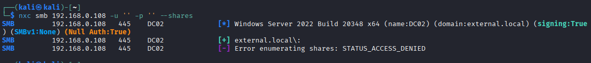


For checking SMB shares using anonymous user:

```bash
nxc smb <DOMAIN_IP> -u 'anonymous' -p '' --shares
```


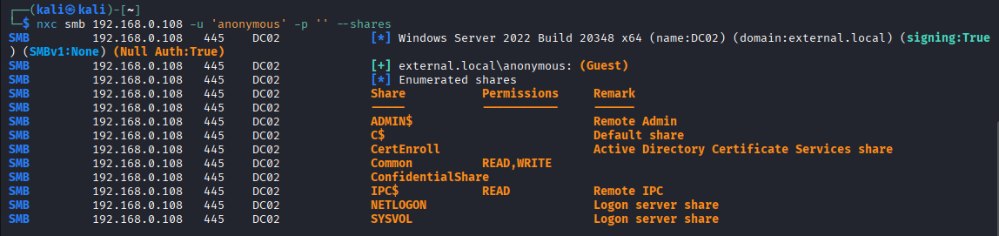


If successful, this means the system is misconfigured and allows unauthenticated access.

***

### Perform user enumeration:

User enumeration is used to identify valid domain users. This helps in password attacks, privilege escalation, and further AD exploitation.

To enumerate users using LDAP anonymously:

```bash
nxc ldap <DOMAIN_IP> -u '' -p '' --users
```


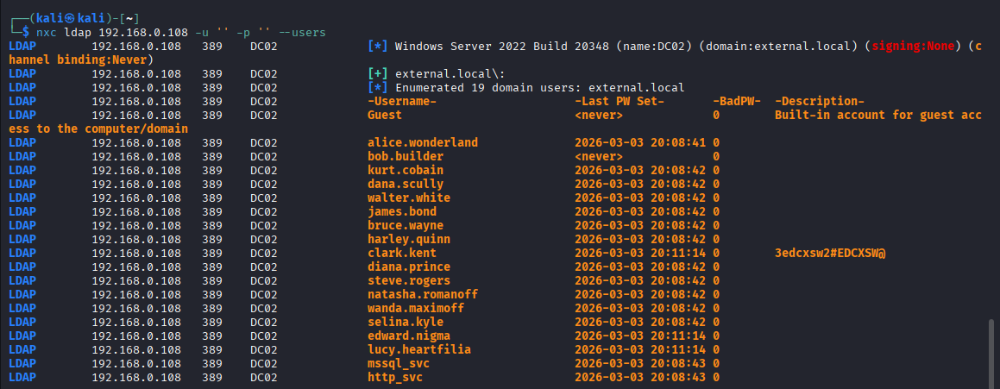


To enumerate users using RID brute-force via SMB:

```bash
nxc smb <DOMAIN_IP> -u 'anonymous' -p '' --rid-brute
```


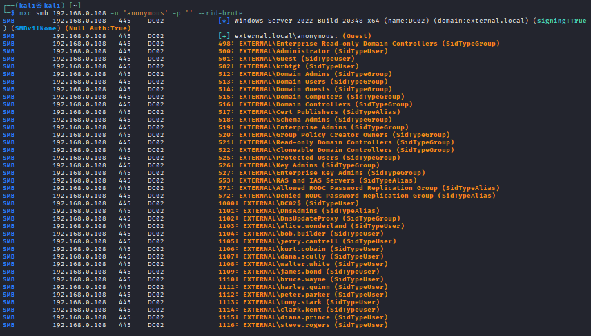


> INFO:
>
> In **Active Directory**, <mark style="color:$primary;">**RID**</mark> stands for <mark style="color:$primary;">**Relative Identifier**</mark>. It is the last part of a **SID (Security Identifier)** and is used to uniquely identify a user, group, or computer account within a domain.
>
> A SID is the full unique identity value assigned to every security object in Windows. It looks like this:
>
> ```
> S-1-5-21-1111111111-2222222222-3333333333-1105
> ```
>
> The SID has two parts:
>
> * **Domain SID** → <mark style="color:$primary;">`S-1-5-21-1111111111-2222222222-3333333333`</mark>
> * **RID** → <mark style="color:$primary;">`1105`</mark>
>
> The **RID** is added to the domain SID to create the complete SID for each account.

To filter only user accounts from RID brute output:

```bash
nxc smb <DOMAIN_IP> -u 'anonymous' -p '' --rid-brute | grep -ia SidTypeUser
```


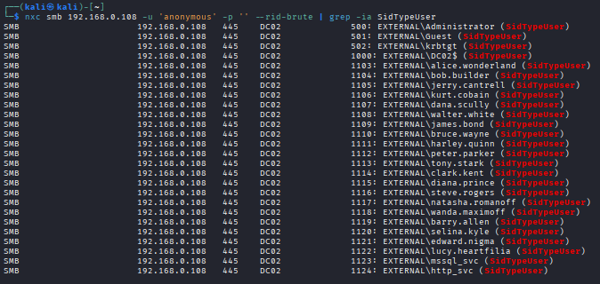


To save extracted users:

```bash
nxc smb <DOMAIN_IP> -u 'anonymous' -p '' --rid-brute | grep -ia SidTypeUser > a.txt
```


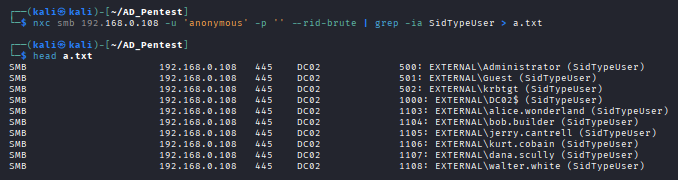


Clean usernames step-by-step:

Extract usernames:

```bash
cut -d '\' -f 2 a.txt > b.txt
```


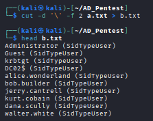


Remove extra fields:

```bash
cut -d '(' -f 1 b.txt > c.txt
```


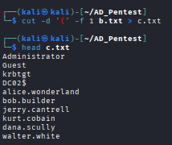


Remove spaces and finalize list:

```bash
cat c.txt | sed 's/ //g' > users.txt
```


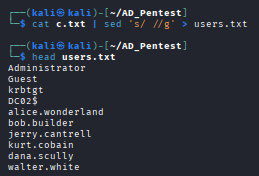


View final user list:

```bash
cat users.txt
```

This creates a clean wordlist of valid users for further attacks.

***

### Users Enumeration using ldapsearch:

This step uses LDAP queries to extract user information directly from the directory service.

To query all user objects:

```bash
ldapsearch -H ldap://<DOMAIN_IP> -x -b "DC=<DOMAIN>,DC=<NAME>" "(objectclass=person)"
```


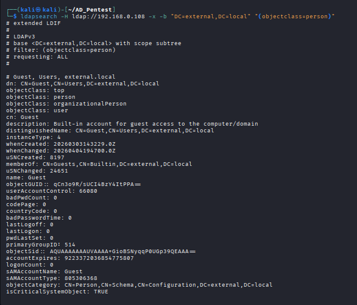


Save these information in a file and analyzed any interesting informations like user passwords. Here we can find a password stored on user info description:


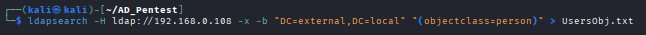


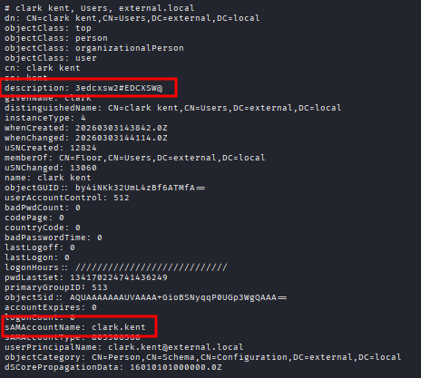


To extract only usernames:

```bash
ldapsearch -H ldap://<DOMAIN_IP> -x -b "DC=<DOMAIN>,DC=<NAME>" "(objectclass=person)" | grep -ia samaccountname
```


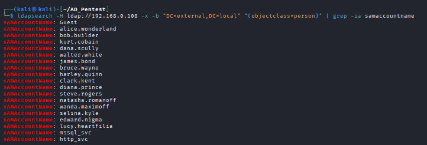


This helps identify valid domain users even without authentication (if allowed).\
We can use that user credentials to gather more information about our target.

To extract only Active users:

```bash
nxc ldap <DOMAIN_IP> -u <USER.NAME> -p <PASSWORD> --active-users
```


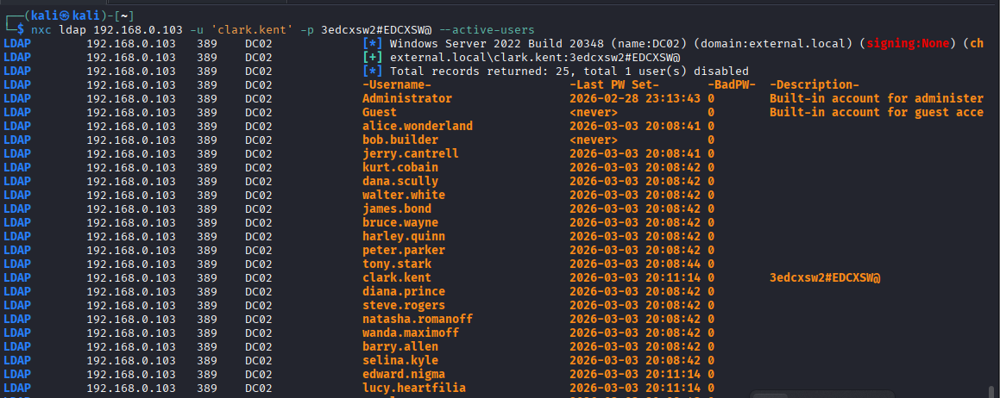


To extract specific user info:

```bash
nxc ldap <DOMAIN_IP> -u <USER.NAME> -p <PASSWORD> --query "(sAMAccountNAME=<USERNAME>)" ""
```


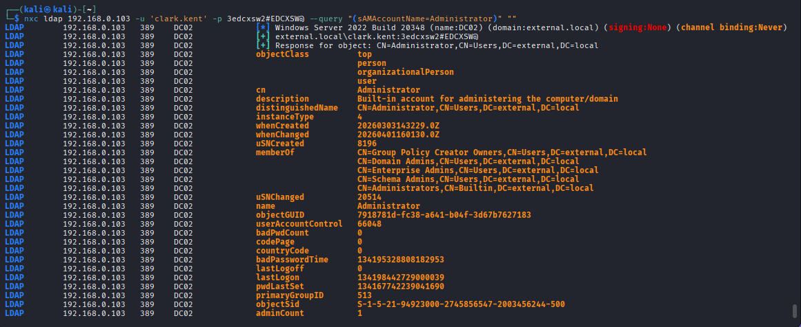


We can also use `*` to get all users info:

```bash
nxc ldap <DOMAIN_IP> -u <USER.NAME> -p <PASSWORD> --query "(sAMAccountNAME=*)" ""
```

***

### Domain Information Dump using ldapdomaindump:

This tool collects detailed domain information such as users, groups, policies, and computers. It requires valid credentials.

To dump domain information:

```bash
ldapdomaindump ldap://<DOMAIN_IP>:389 -u '<DOMAIN.NAME>\<USER.NAME>' -p <PASSWORD>
```


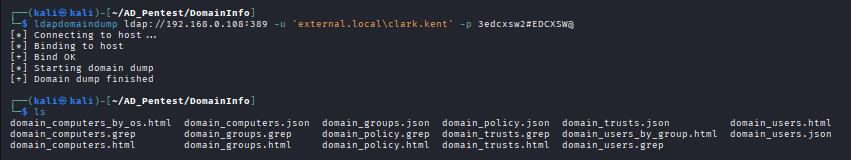


To view the output in browser:

```bash
firefox domain_users.html
```


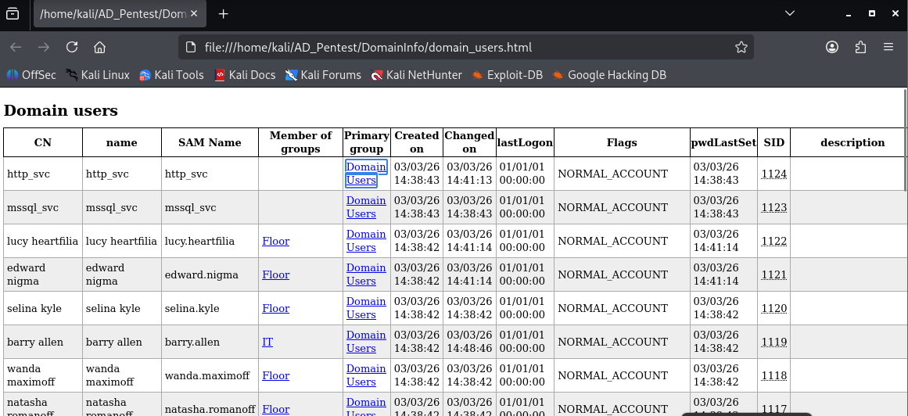


This generates structured HTML files that are easy to analyze.

We analyzed the result and we find that the `alice.wonderland` user has "Don't Require PreAuth" permission set, which is helpful for our farther attacks (ASREPRoasting Attack) .

> **ASREPRoasting** exploits accounts that do not require Kerberos Pre-Authentication to extract service ticket hashes, which can then be cracked offline.


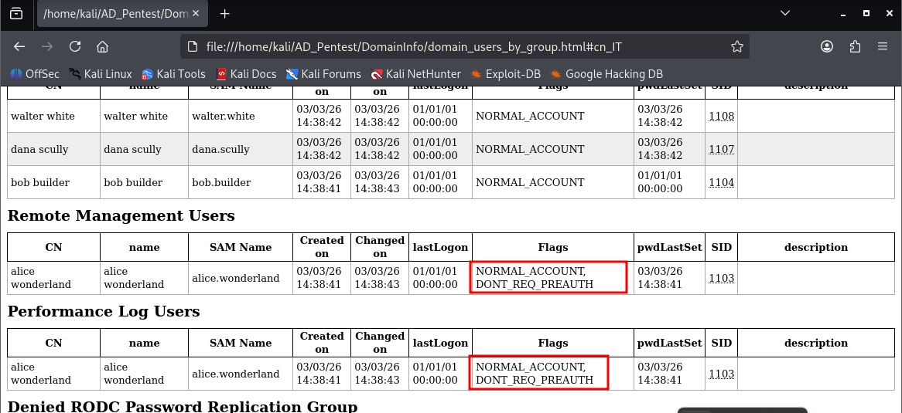


> Note: Without valid credentials, this tool will not work.

***

### Enumeration using RPC:

RPC enumeration helps gather domain information like users and shares using RPC services.

Using NetExec with WMI:

```bash
nxc wmi <DOMAIN_IP> -u '' -p ''
```


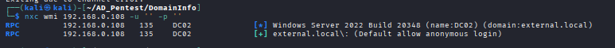


Using rpcclient:

```bash
rpcclient -U '' -N <DOMAIN_IP>
```

This attempts a null session connection to enumerate domain information.


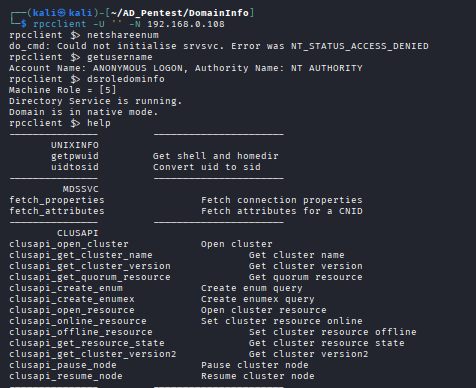


***

#### Find Domain SID

Retrieves the Domain Security Identifier (SID), which is a unique identifier for the domain.

```bash
nxc ldap <DOMAIN_IP> -u <USERNAME> -p <PASSWORD> --get-sid
```


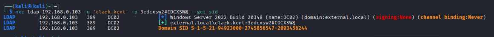


***

### Final Understanding:

Enumeration using NetExec and related tools allows attackers or security professionals to gather critical information such as users, shares, and domain structure. Even without credentials, misconfigurations like anonymous access can expose valuable data. This information becomes the foundation for further attacks like password spraying, privilege escalation, and lateral movement in Active Directory environments.

Learn more about Enumeration using NetExec [here](https://www.hackingarticles.in/active-directory-pentesting-using-netexec-tool-a-complete-guide/).
