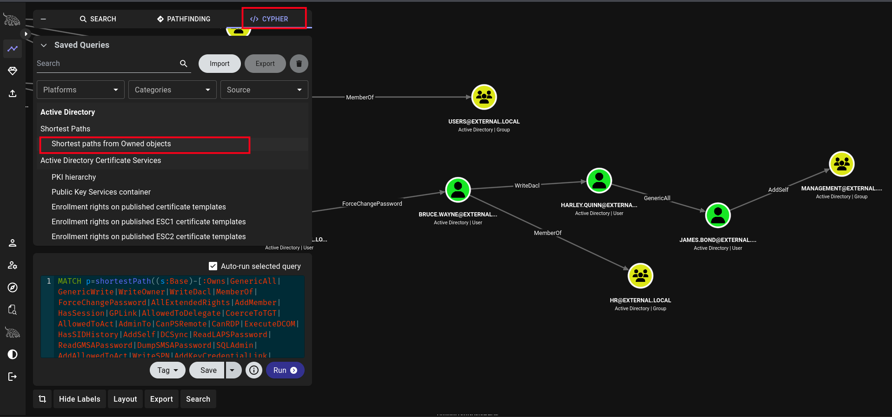
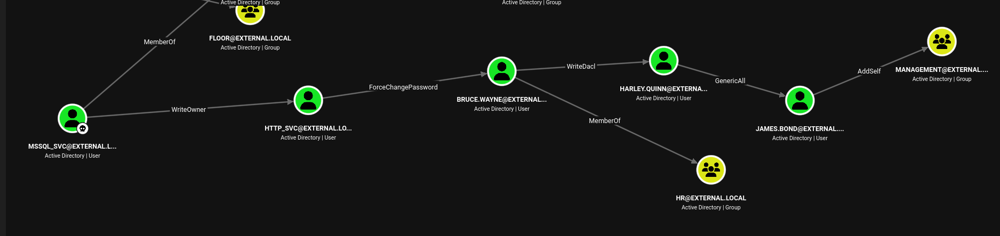
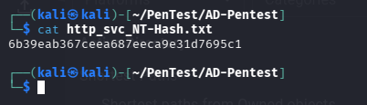
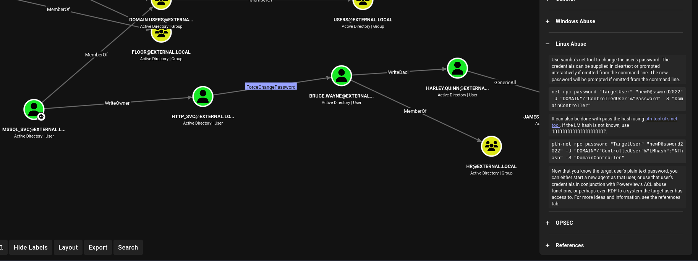
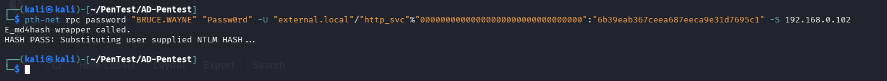
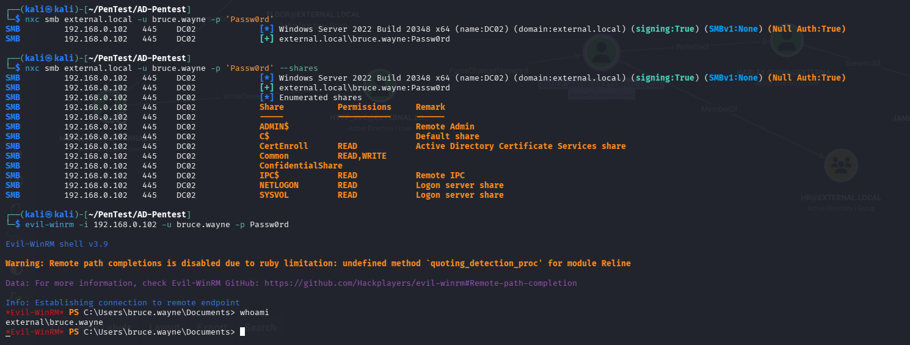

# 3.2.2 ForceChangePassword Abuse

**ForceChangePassword** is an Active Directory permission that allows one user or account to reset the password of another user without knowing the current password. An account with this permission can directly set a new password for the target user and then authenticate using the newly assigned credentials. During Active Directory penetration testing, this permission is commonly abused for privilege escalation and lateral movement because it provides immediate access to the target account.

## Identify the Attack Path

After importing the BloodHound data and loading the [custom queries](https://github.com/CompassSecurity/BloodHoundQueries/blob/master/BloodHound_Custom_Queries/customqueries.json), we identified a privilege escalation path using the **Shortest Path from Owned Object** analysis.








At this stage, the `http_svc` account had already been compromised and marked as owned in BloodHound. While reviewing the attack paths, BloodHound revealed that the `http_svc` account possessed the **ForceChangePassword** permission over the `bruce.wayne` user account.

The **ForceChangePassword** permission allows an account to reset another user's password without knowing the user's current password. This makes it a valuable privilege escalation technique in Active Directory environments.

***

## Abuse the ForceChangePassword Permission

We have the NT-Hash of the `http_svc` user.





To view the available abuse methods, select the **ForceChangePassword** edge in BloodHound and review the **Linux Abuse** section.





We can perform force change password using the two methods.

1. Change password using Samba's Net Tool.
2. Change a User's Password Using Pass-the-Hash.

In this scenario, we possess the NTLM hash of the `http_svc` account but do not know its plaintext password. Since Samba's standard `net` utility requires a plaintext password for authentication, we will use the Pass-the-Hash technique to perform the password reset.

***

#### Force Change a User's Password Using Pass-the-Hash

**Purpose:** This command uses the `pth-net` utility from the Pass-the-Hash Toolkit to perform a password reset operation against an Active Directory user account using NTLM hashes instead of a plaintext password for authentication. This is useful during security assessments when valid NTLM credentials have been obtained and the account has sufficient permissions to reset the target user's password.

```bash
pth-net rpc password <"TARGET_USER"> <"NEW_PASSWORD"> -U <"DOMAIN.NAME"/"CONTROLLED_USER"%"LMhash":"NThash"> -S <"DOMAIN-CONTROLLER-IP">
```

> #### Note on the LM Hash
>
> In many modern Active Directory environments, the LM hash is not stored or known. In such cases, a placeholder value is commonly used:
>
> ```
> ffffffffffffffffffffffffffffffff
> ```
>
> This placeholder is supplied in the LM hash field while the actual NT hash is provided in the NT hash field.





### Verify the Password Reset

After successfully resetting the password, verify that the new credentials are valid by authenticating to the domain.

#### Validate Authentication

```bash
nxc smb <DOMAIN.NAME> -u <TARGET_USER> -p <'NEW_PASSWORD'>
```

#### Enumerate Accessible SMB Shares

```bash
nxc smb <DOMAIN.NAME> -u <TARGET_USER> -p <'NEW_PASSWORD'> --shares
```

#### Obtain Remote Shell Access

```bash
evil-winrm -i <DOMAIN-IP> -u <TARGET-USER> -p <NEW-PASSWORD>
```

Successful authentication confirms that the password reset operation was successful and that access to the `bruce.wayne` account has been obtained.





***

### Alternative Method: Samba Net Tool

If the plaintext password of the controlled account is available, the password reset operation can also be performed using Samba's `net` utility.

#### Change an Active Directory User's Password Using Samba's Net Tool

**Purpose:** This command uses Samba's `net` utility to change the password of a target Active Directory user account through the Remote Procedure Call (RPC) interface. The operation requires an account that has been delegated the appropriate password reset permissions on the target user object.

```bash
net rpc password <"TARGET_USER"> <"NEW_PASSWORD"> -U <"DOMAIN.NAME"/"CONTROLLED_USER"%"PASSWORD"> -S "DOMAIN-CONTROLLER"
```

This method is often simpler than Pass-the-Hash but requires knowledge of the authenticating account's plaintext password.
