# Downloading & Installing VMware Workstation

You can download the VMware Workstation Pro from their official website [here](https://www.vmware.com/products/desktop-hypervisor/workstation-and-fusion).

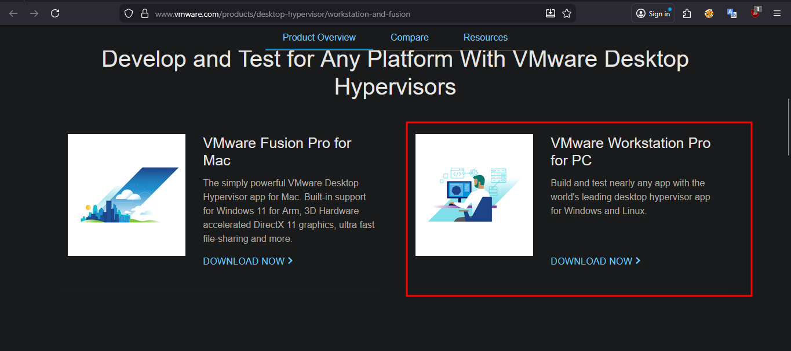

After Downloading double click on the .exe file.

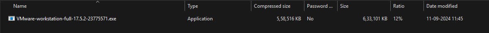

A User Account Control pop-up is open click on **Yes**.

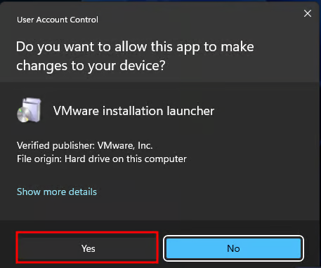

VMware workstation pro setup wizard is open click on **Next**.

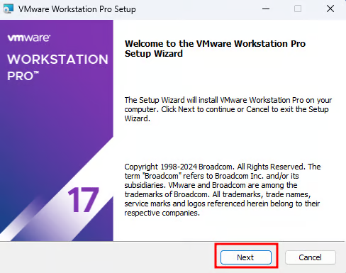

Read and Accept the VMware End User license agreement.
\
Click **Next** to Continue.

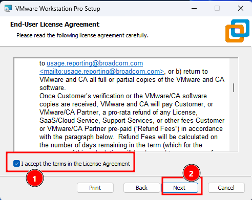

Specify the Installation directory. You can also enable Enhance keyboard driver
\
here.
\
Click Next to continue.

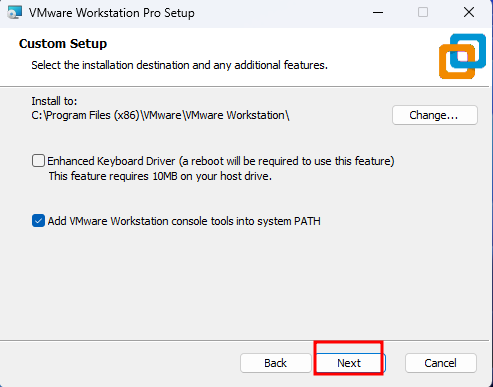

You can enable product startup and join the VMware Customer Experience
\
Improvement program here.
\
Click Next to Continue.

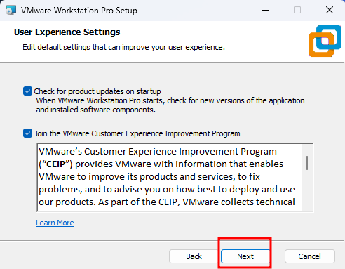

Select the shortcuts you want to create for easy access to VMware Workstation.
\
Click Next to Continue.

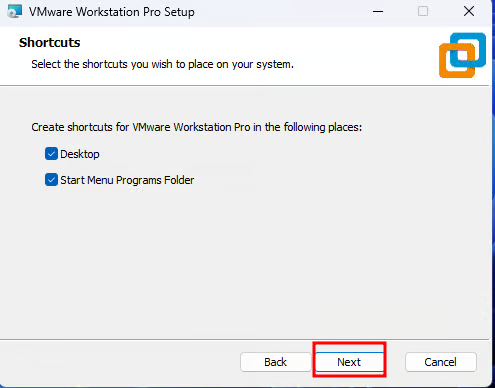

Click the Install button to start the installation.

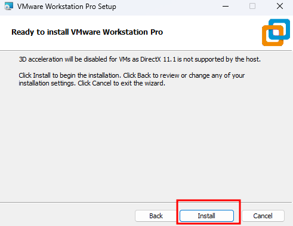

The installation will take just a few seconds to complete.

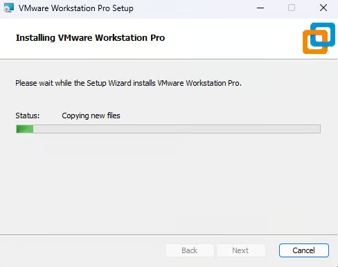

Next If you have the license key, then click on License to enter the license or you can also click Finish to exit the Installer.

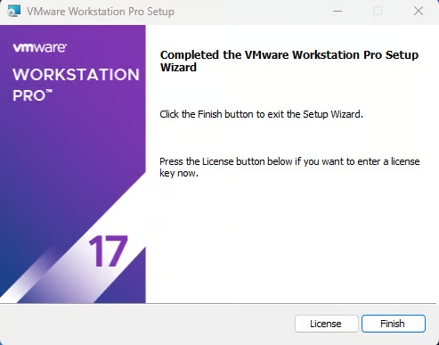

Provide the License Key for VMware Workstation Pro.
\
Press Enter to continue. (If you don't have an License Key then you click on Skip)

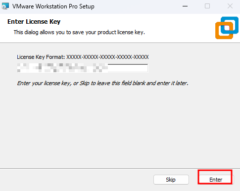

Click Finish to exit the wizard.

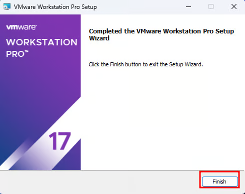

That’s it we have successfully installed VMware Workstation Pro.

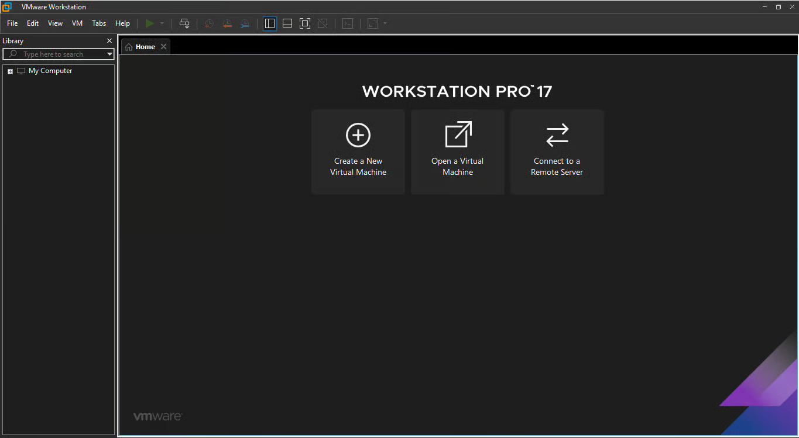

