# Installing Windows Server 2022 & Configure DC01 (Internal DC)

Now we will be setting up the internal network. This will be another Domain Controller that is in the internal network with 1 networking interface. This machine will also be our go to machine when more than one machine is needed for an attack. Such as within an NTLMRelay attack.

Open VMWare Workstation and click on Create a New Virtual Machine --> Select Typical (Recommendation) option and click on Next.


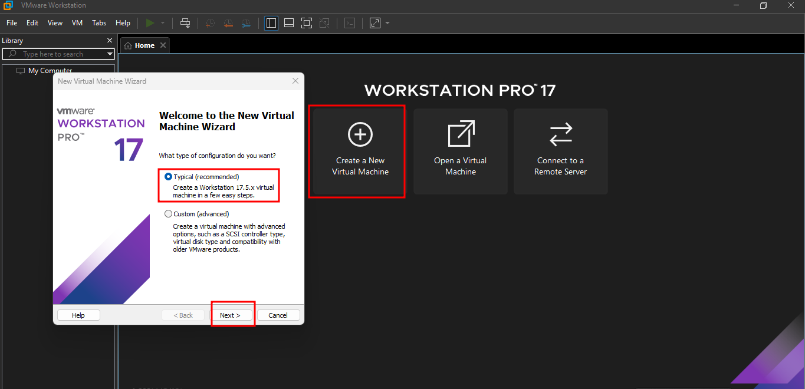


On the Next Page select "I will install the operation system later" and click on Next.


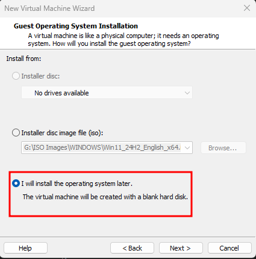


Next page select Operating System "Microsoft Windows" and Version "Windows Server 2022" and then Click on Next.


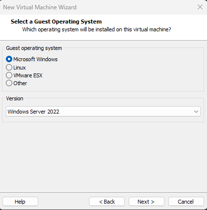


Next page give your Virtual Machine name (DC01) and Select location where you want to store the virtual machine and then Click on Next.


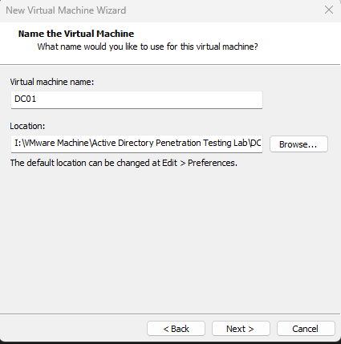


Next Specify the Disk capacity (Default) and select "Store virtual disk as a single file".


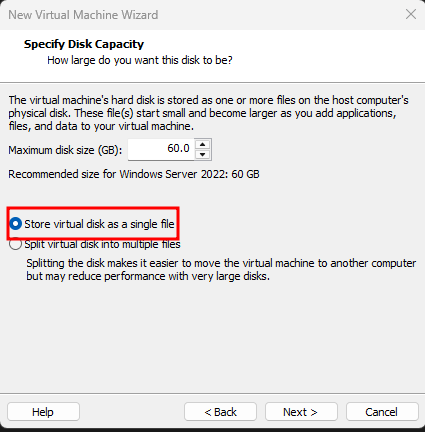


On the Next page click on "Customize Hardware.."&#x20;


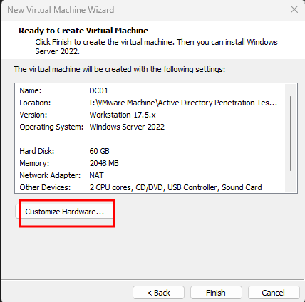


Next specify the Memory best on your Host System Configuration. Here I have 16 GB of my system memory that way I specify 4 GB RAM.&#x20;


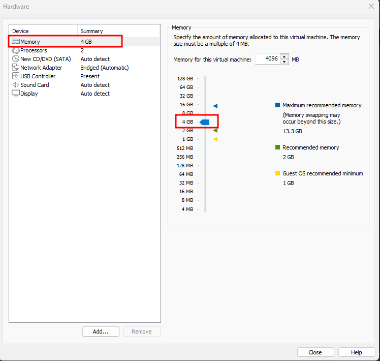


Next Select Number of Processor.


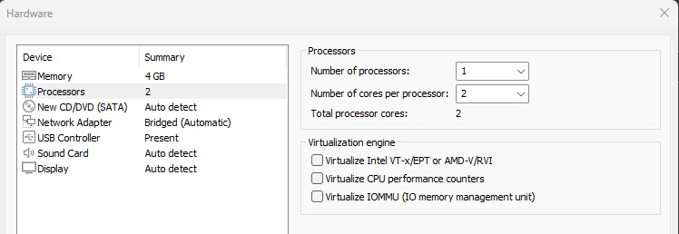


Next go to the New CD/DVD (SATA) and select the Use ISO image file option and select the ISO Image file of Windows Server 2022 from your browser. \
Download Windows Server 2022 ISO Image from [here](https://www.microsoft.com/en-us/evalcenter/download-windows-server-2022).


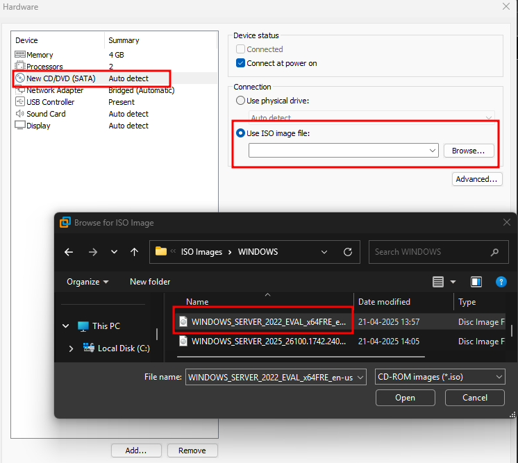


Select newly added Network Adapter -> Select Custom -> Select Host-Only from Drop-Down Menu.


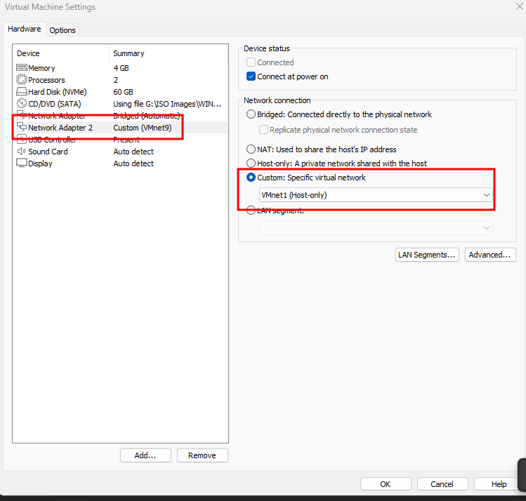


Then click on Close and then click on Finish.


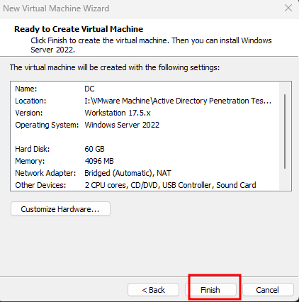


After Configure all setting click on Power On this virtual machine option.


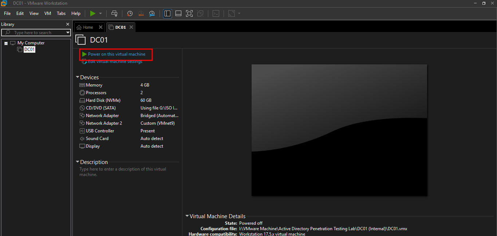


After some time you can see the Message "Press any key to boot..." then click on any key from keyboard to boot the system from CD/DVD.

Then after some time you can see that the Microsoft Server Operating System Setup Window is open. Now select your relevant Language,  Time, and Keyboard.


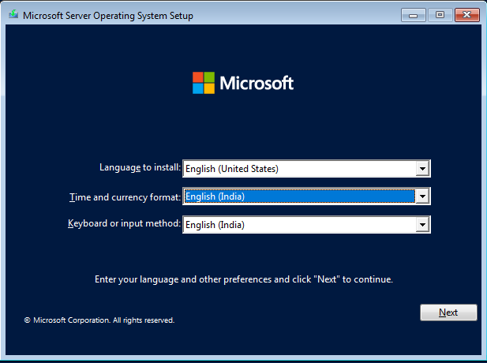


Next click on Install.


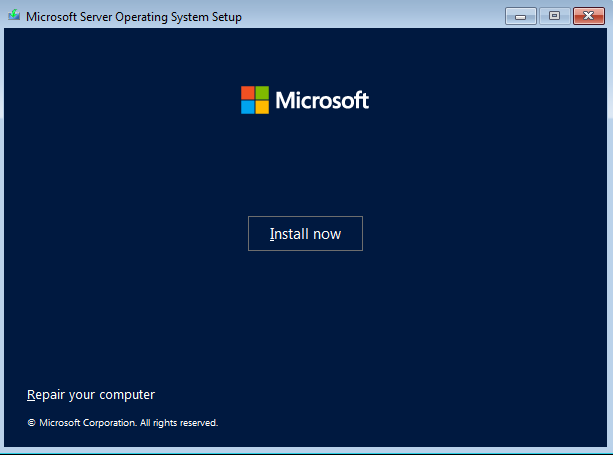


Next select the "Windows Server 2022 Standard Evaluation (Desktop)" version and then click on Next.


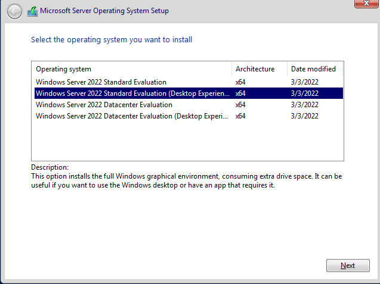


Next page, Accept the Microsoft license agreement and click on Next.


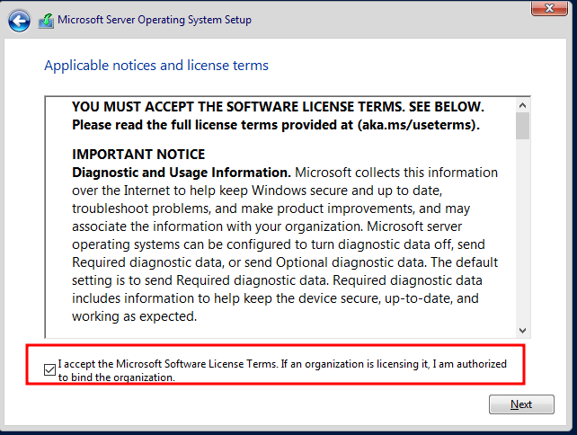


Next page, Select Custom Installation.


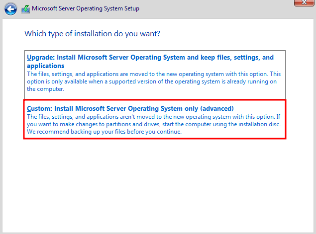


Next page, Click on Next.


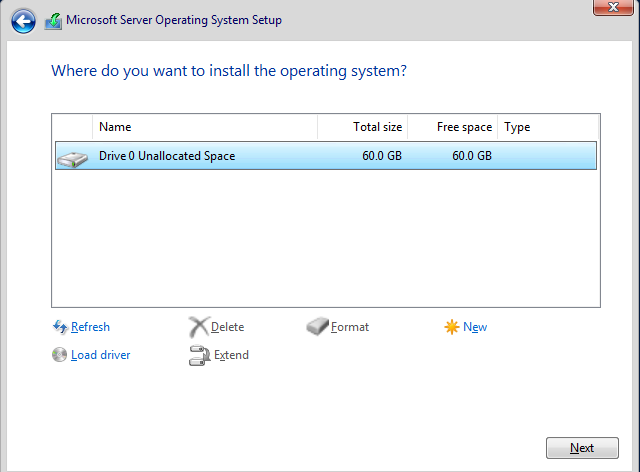


Now we can see our Windows Server Installation process is stating.


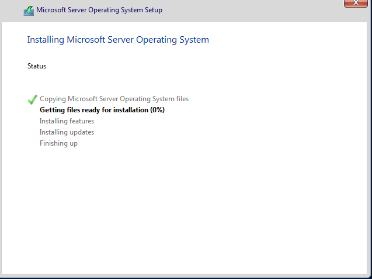


After completing the installation then set the Administrator User Password and Click on Finish.<br>


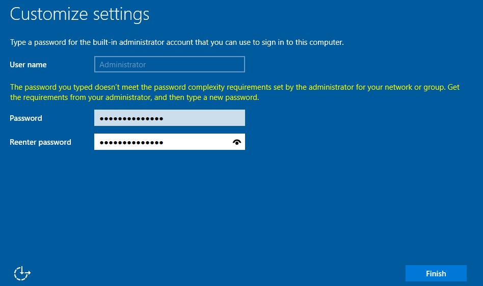


Now our Windows Server 2022 (DC01) is successfully installed.


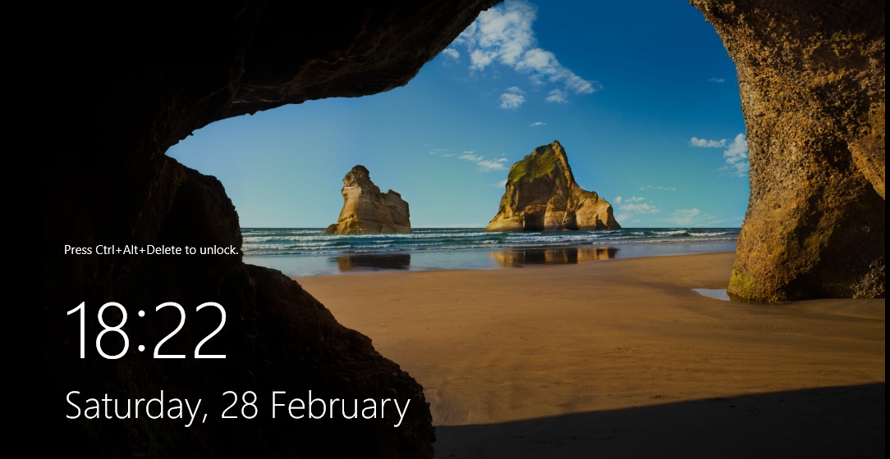


Now to login click on VM on the top of the VMWare Menu bar then click on Send Ctrl+Alt+Del option or click on Directly to the Ctrl+Alt+Del option:


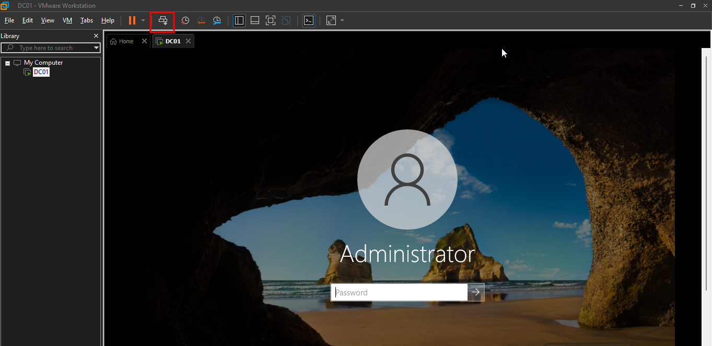


Now Install VMware Tools. TO Download it click on VM on the menu bar and then click on Install VMware Tools.


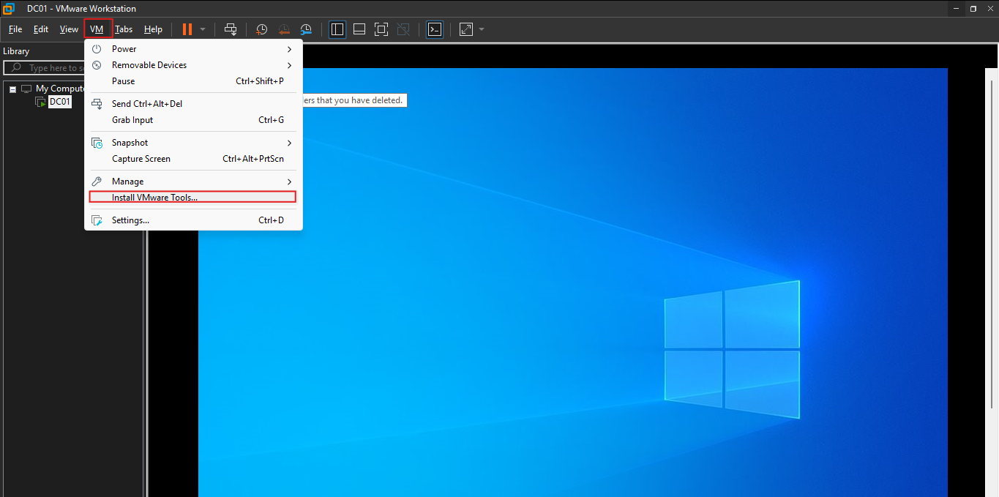


After than open the File Explorer -> My PC -> double click on DVD Drive: VMware Tools.&#x20;


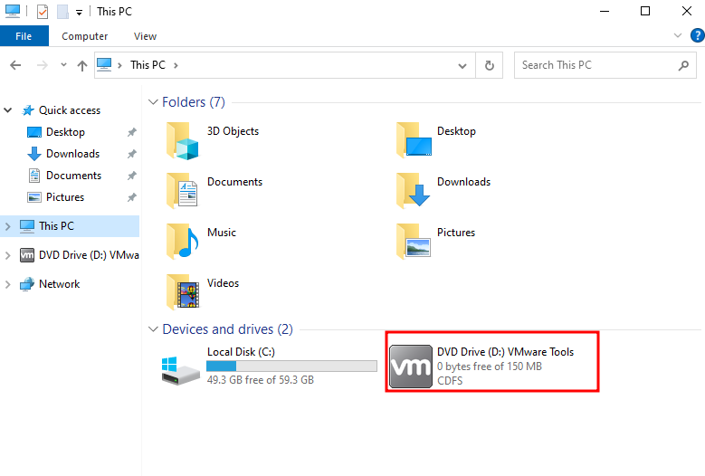


By set as default click Next and Next and finally click on Finish to install.

After completing the installation System restart windows will be open click on "No" right now.


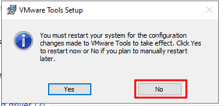


Now we want to rename our Server. So open PowerShell and run the following command to rename the Server.

```powershell
Rename-Computer -NewName DC01 -Force
Restart-Computer
```


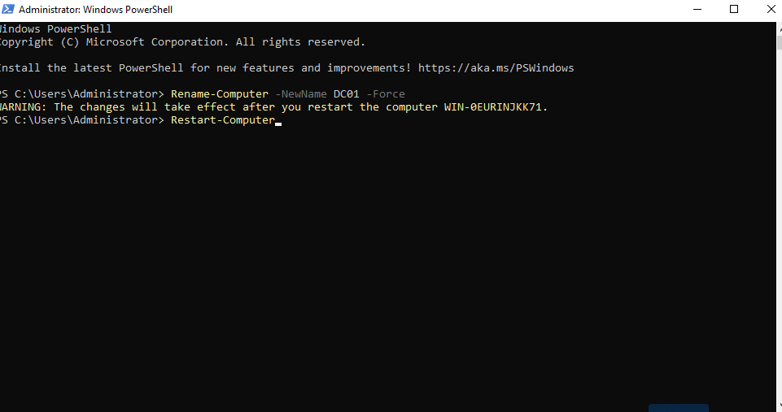


Then after re-start the system run the following script to build the domain controller:

```powershell

# Set execution policy to unrestricted (if needed)
Set-ExecutionPolicy Unrestricted -Force
# Define Domain Variables
$DomainName = "internal.local"
$SafeModeAdminPassword = ConvertTo-SecureString "Pa$$w0rd@12345" -AsPlainText -Force
$DNSServer = "127.0.0.1" # This will be the local DC
$LogPath = "C:\Windows\NTDS"
$SysvolPath = "C:\Windows\SYSVOL"

# Set a Static IP Address (Ensure the correct InterfaceIndex)
$InterfaceIndex = (Get-NetAdapter | Where-Object { $_.Status -eq "Up" }).InterfaceIndex
Set-DnsClientServerAddress -InterfaceIndex $InterfaceIndex -ServerAddresses ($DNSServer, "8.8.8.8")

# Install Active Directory Domain Services
Write-Host "Installing Active Directory Domain Services..."
Install-WindowsFeature -Name AD-Domain-Services -IncludeManagementTools

# Import ADDSDeployment Module
Import-Module ADDSDeployment

# Promote to a Domain Controller
Write-Host "Promoting Server to Domain Controller..."
Install-ADDSForest `
  -DomainName $DomainName `
  -ForestMode "WinThreshold" `
  -DomainMode "WinThreshold" `
  -InstallDns:$true `
  -NoRebootOnCompletion:$false `
  -LogPath $LogPath `
  -SysvolPath $SysvolPath `
  -SafeModeAdministratorPassword $SafeModeAdminPassword `
  -CreateDnsDelegation:$false `
  -Force:$true
Write-Host "Domain Controller setup complete! Rebooting now..."
Restart-Computer -Force
  
```


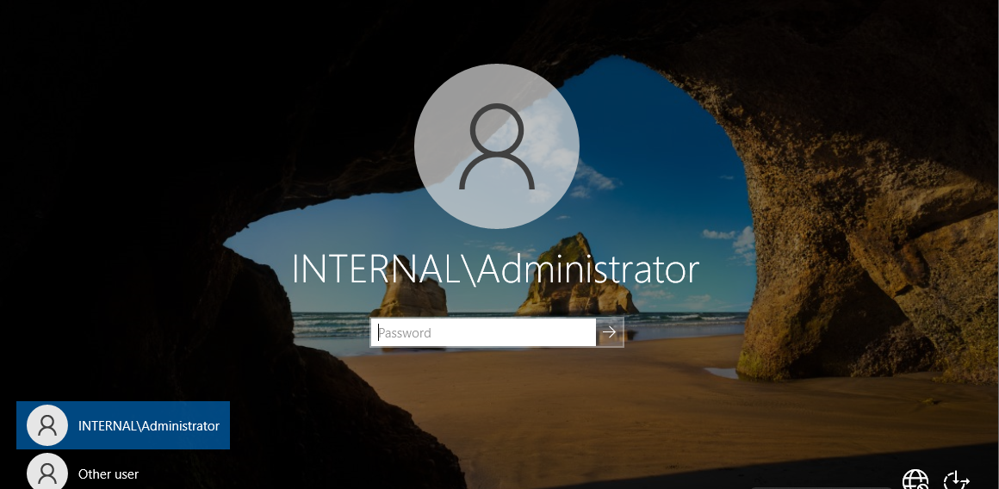


Login and run this script again on PowerShell:

```powershell
net user alice.wonderland P@ssw0rd! /domain /add
net user alice.wonderland P@ssw0rd! /add
net localgroup administrators /add alice.wonderland
net group "domain admins" /add alice.wonderland
  
```


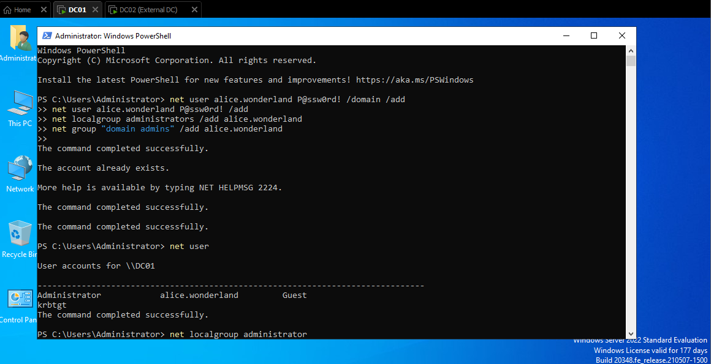

