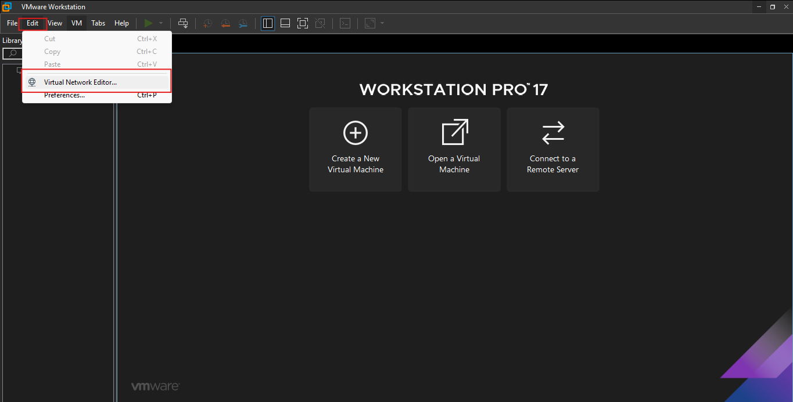
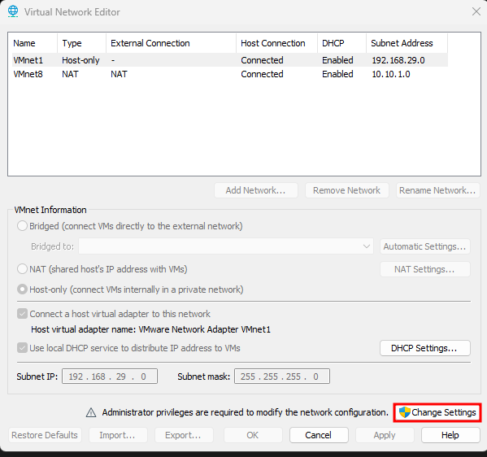
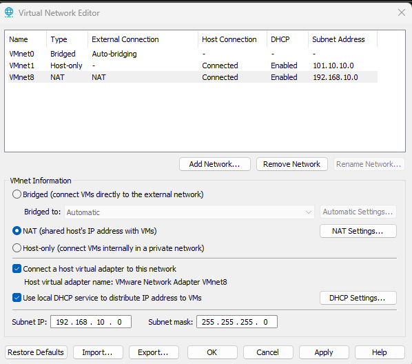
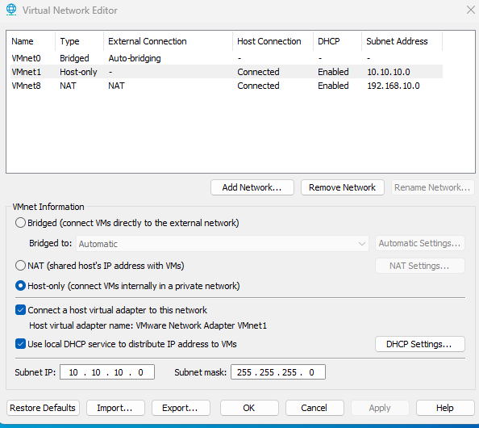
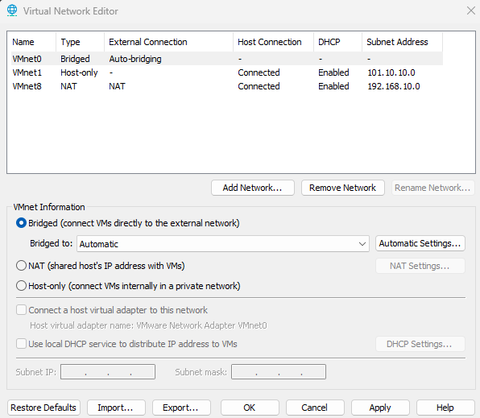
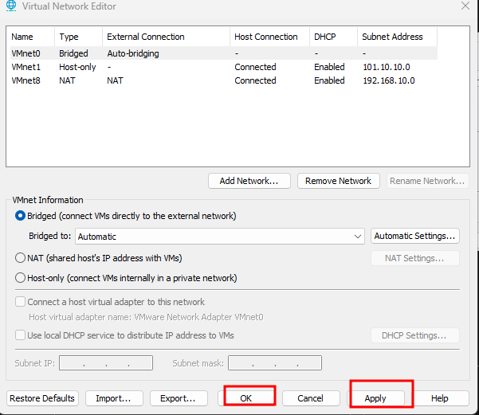

# VMware Network Adaptor Settings

Open VMWare Workstation --> Click on Edit --> Click on Virtual Network Editor.

On the Next page click on "Change Setting" option.

User Account Control pop-up will be open click on Yes option.

Then click on  VMnet8 -> Select NAT -> Set Subnet IP: 192.168.10.0 and Subnet Mask: 255.255.255.0

On the Next, Same Select VMnet1 -> Select Host-Only -> Set Subnet IP: 10.10.10.0 and Subnet Mask: 255.255.255.0.

Next you can also select another VMNet (VMnet0) from Add Network option and configure as a Bridged Adapter.

After successfully configure everything, click on Apply and then OK.

