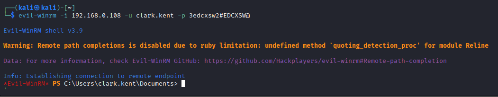

# 1.5.2 Kerberoasting with Impacket

## Enumerating Service Accounts

The first step is to identify service accounts that have Service Principal Names (SPNs) configured. These accounts are potential targets for Kerberoasting because Kerberos service tickets for these accounts are encrypted using the service account’s password hash.

Use the following Impacket command to enumerate SPNs in the domain:

```bash
impacket-GetUserSPNs '<DOMAIN.NAME>/<USERNAME>:<PASSWORD>'
```

<figure><figcaption></figcaption></figure>

The output displays accounts associated with SPNs. In this example, the following service accounts were identified:

* `http_svc`
* `mssql_svc`

These accounts are likely running services such as web servers or database services inside the Active Directory environment.

***

### Requesting Kerberos Service Tickets

After identifying the service accounts, the next step is to request Kerberos service tickets (TGS tickets) for those accounts. These tickets contain data encrypted with the target service account’s NTLM password hash.

Run the following command to request the tickets:

```bash
impacket-GetUserSPNs '<DOMAIN.NAME>/<USERNAME>:<PASSWORD>' -request -dc-ip <DOMAIN-IP>
```

<figure><figcaption></figcaption></figure>

<figure><figcaption></figcaption></figure>

The command returns Kerberos ticket hashes in a format suitable for offline password cracking. Save the hashes into a file for the next stage of the attack.

***

### Cracking the Kerberos Ticket Hashes

Once the ticket hashes are collected, they can be cracked offline using password cracking tools and a wordlist. If the service account uses a weak password, the plaintext password may be recovered successfully.

#### Cracking with John the Ripper

```bash
john <HASHFILE.txt> --wordlist=/usr/share/wordlists/rockyou.txt
```

<figure><figcaption></figcaption></figure>

#### Cracking with Hashcat

```bash
hashcat -m 13100 <HASHFILE.txt> /usr/share/wordlists/rockyou.txt
```

<figure><figcaption></figcaption></figure>

<figure><figcaption></figcaption></figure>

If the password is successfully cracked, the plaintext credentials of the service account will be revealed.

***

## Verifying the Credentials

After recovering the password, it is important to verify whether the credentials are valid within the domain environment. This confirms that the Kerberoasting attack was successful and that the account can be used for further enumeration or privilege escalation activities.

The following command can be used to verify access and enumerate available SMB shares:

```bash
nxc smb <DOMAIN.NAME> -u <USERNAME> -p '<PASSWORD>' --shares
```

<figure><figcaption></figcaption></figure>

If authentication succeeds, the credentials are valid and the service account may provide additional access within the Active Directory environment.
