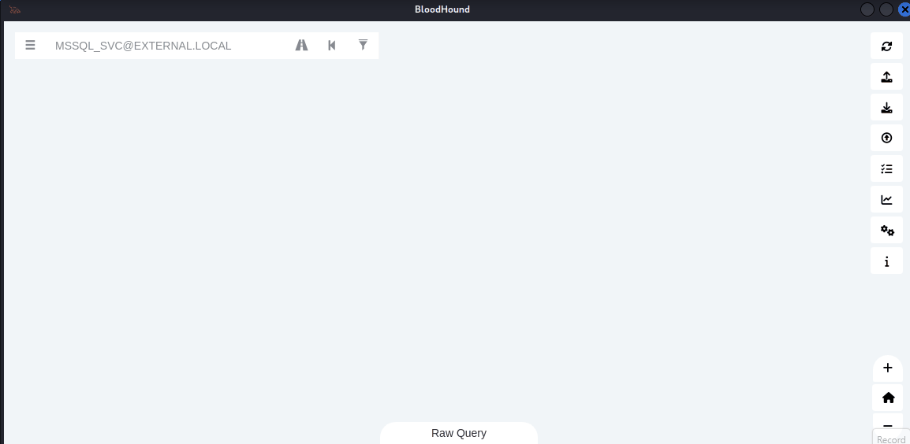
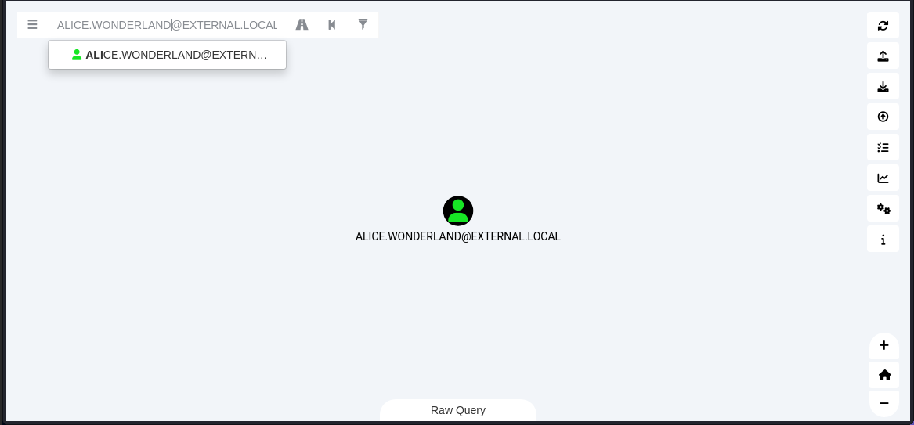
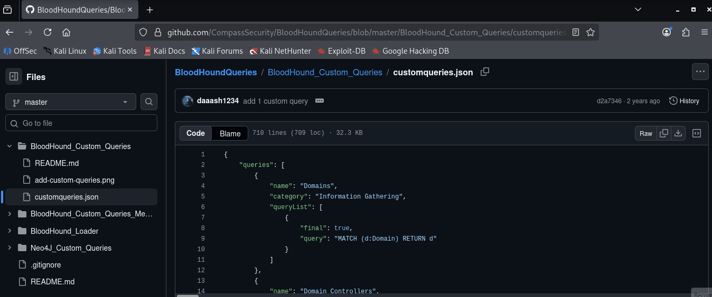

# Bloodhound Legacy

### Download BloodHound Legacy

Download the BloodHound Legacy release from the official repository and extract the archive:

```bash
wget https://github.com/SpecterOps/BloodHound-Legacy/releases/download/v4.3.1/BloodHound-linux-x64.zip
unzip BloodHound-linux-x64.zip
cd BloodHound-linux-x64
```

***

## Install Neo4j

BloodHound uses Neo4j as its graph database backend for storing and visualizing Active Directory relationships.

Install Neo4j using the following command:

```bash
sudo apt install neo4j -y
```

Start the Neo4j database service:

```bash
sudo neo4j console
```

<figure><figcaption></figcaption></figure>

After starting the service, open the Neo4j web interface in your browser:

```
http://localhost:7474
```

***

## Configure Neo4j Credentials

Login using the default credentials:

```
Username: neo4j
Password: neo4j
```

After successful authentication, Neo4j will prompt you to change the default password. Set a strong password and remember it, as it will be required to authenticate with BloodHound.

<figure><figcaption></figcaption></figure>

<figure><figcaption></figcaption></figure>

***

## Start BloodHound Legacy

Run BloodHound using the following command:

```bash
./BloodHound --no-sandbox
```

When the BloodHound login page appears, authenticate using the Neo4j credentials:

```
Username: neo4j
Password: <NEW_PASSWORD>
```

After successful authentication, BloodHound will connect to the Neo4j database and the interface will be ready for Active Directory analysis.

<figure><figcaption></figcaption></figure>

<figure><figcaption></figcaption></figure>

***

## Collect BloodHound Data

Use `bloodhound-python` to collect Active Directory information from the target environment:

```bash
bloodhound-python -u <USERNAME> -p '<PASSWORD>' -ns <DOMAIN_IP> -d <DOMAIN.NAME> -c all
```

The command generates multiple JSON files containing information about users, groups, computers, sessions, ACLs, trusts, and other Active Directory relationships.

<figure><figcaption></figcaption></figure>

<figure><figcaption></figcaption></figure>

Here see that the many json files are created. This all file has store information of the domain environment. Now we try to map the target infrastructure by using this files with bloodhound.

***

## Upload Data into BloodHound

To visualize and analyze the collected Active Directory data, upload the generated JSON files into BloodHound.

1. Open the BloodHound GUI interface.
2. Click on **Upload Data** from the right-side panel.
3. Select all generated JSON files and click **Open**.
4. After the upload completes successfully, click **Clear Finished** to close the upload tab.

BloodHound will now process and map the Active Directory infrastructure.

<figure><figcaption></figcaption></figure>

## Analyze Active Directory Relationships

After importing the data, use the search bar to locate a specific user account.

1. Search for the username in the BloodHound search bar.
2. Select the user object from the results.
3. Right-click the user and select **Mark User as Owned** to indicate that the account has already been compromised.
4. Double-click the user object to explore detailed information such as:
   * Group Memberships
   * Local Administrator Rights
   * Execution Rights
   * Session Information
   * Outbound Object Control
   * Delegated Permissions

BloodHound also provides attack path analysis and privilege escalation relationships within the domain environment.

<figure><figcaption></figcaption></figure>

<figure><figcaption></figcaption></figure>

***

## Abuse Information and Permission Analysis

BloodHound contains built-in abuse guidance for many Active Directory permissions and attack paths.

To view abuse information:

1. Right-click on a permission or relationship edge.
2. Select the **Help** option.
3. A new window will appear containing detailed information about the selected permission, including possible abuse techniques and attack scenarios.

This feature helps penetration testers understand how specific privileges may be leveraged for lateral movement or privilege escalation.

<figure><figcaption></figcaption></figure>

***

## Add Custom Queries into BloodHound

Custom Queries in BloodHound are prebuilt or user-created Cypher queries used to identify important relationships, attack paths, privileged accounts, misconfigurations, and vulnerable objects within an Active Directory environment.

To add custom queries:

1. Download or copy custom query definitions from trusted [GitHub ](https://github.com/CompassSecurity/BloodHoundQueries/blob/master/BloodHound_Custom_Queries/customqueries.json)repositories.
2. Paste the queries into the following file:

```
/home/kali/.config/bloodhound/customqueries.json
```

<figure><figcaption></figcaption></figure>

<figure><figcaption></figcaption></figure>

After editing the file:

1. Open the BloodHound interface.
2. Navigate to the **Analysis** tab.
3. Scroll down to the **Custom Queries** section.
4. Click on **Load** to import the custom queries.

Once loaded, the custom queries can be used to quickly identify interesting attack paths, privilege escalation opportunities, and security weaknesses within the Active Directory environment.

<figure><figcaption></figcaption></figure>
