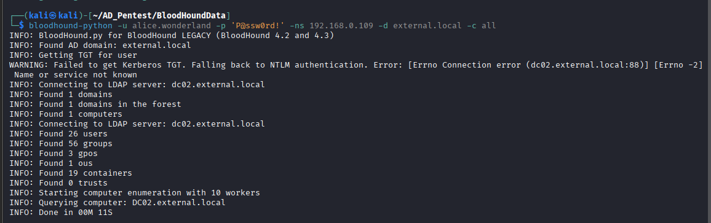
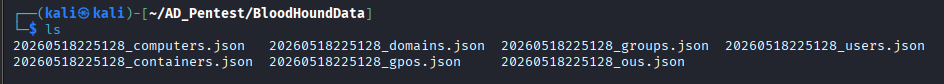
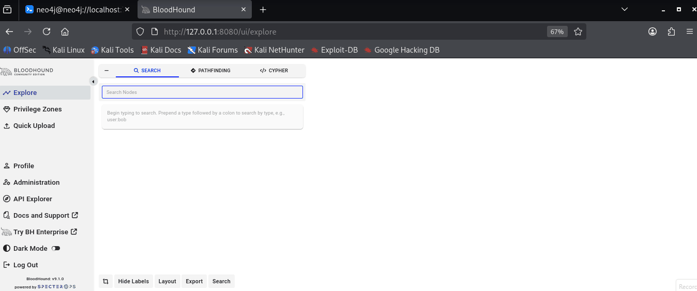
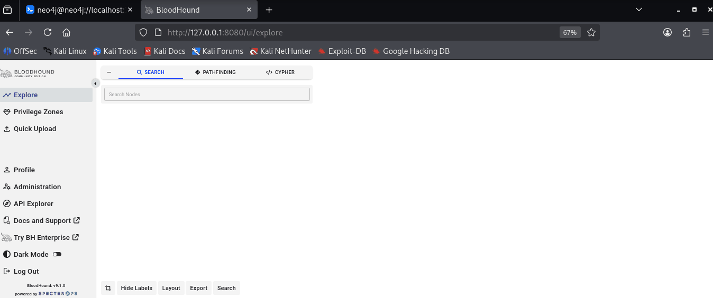
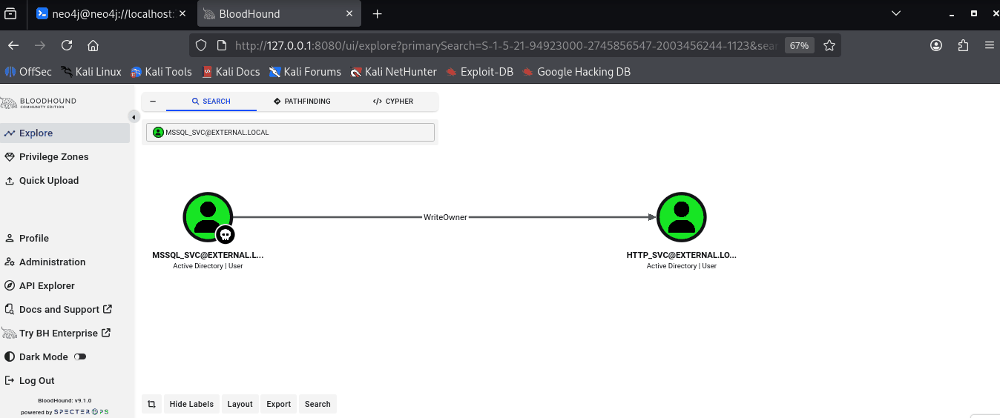

# 1.6.2 Bloodhound Community Edition

## Installation

To install the bloodhound CE run:

```bash
sudo apt update && sudo apt install -y bloodhound
bloodhound-setup
```

<figure><figcaption></figcaption></figure>

After completing setup and starting the service, open the Neo4j web interface in your browser.

***

## Configure Neo4j Credentials

Login using the default credentials:

```
Username: neo4j
Password: neo4j
```

After successful authentication, Neo4j will prompt you to change the default password. Set a strong password and remember it, as it will be required to authenticate with BloodHound.

<figure><figcaption></figcaption></figure>

<figure><figcaption></figcaption></figure>

> Once you have setup the new password, please update `/etc/bhapi/bhapi.json` with the new password before running bloodhound.

<figure><figcaption></figcaption></figure>

***

## Start BloodHound

Run BloodHound using the following command:

```bash
bloodhound-start
```

<figure><figcaption></figcaption></figure>

Now bloodhound GUI interface is open. Now login using default credentials `admin:admin` and after login change the password if needed.

<figure><figcaption></figcaption></figure>

***

## BloodHound GUI Sections

<figure><figcaption></figcaption></figure>

#### Explore

The **Explore** section is used to search and visualize Active Directory objects such as users, groups, computers, domains, and sessions. It helps analysts understand relationships and attack paths inside the domain environment.

#### Privilege Zones

The **Privilege Zones** section displays sensitive or high-value areas in the Active Directory environment. It helps identify privileged accounts, administrative access, and critical attack paths that may lead to domain compromise.

#### Quick Upload

The **Quick Upload** section allows users to upload BloodHound collection files such as JSON or ZIP files generated by tools like `bloodhound-python` or SharpHound. After uploading, BloodHound processes and maps the AD environment.

#### Search

The **Search** tab is used to find specific Active Directory objects quickly. Users can search for usernames, groups, computers, or other domain objects and analyze their relationships and permissions.

#### Pathfinding

The **Pathfinding** section is used to identify attack paths between two objects. It helps penetration testers find possible privilege escalation or lateral movement routes from a compromised account to high-value targets like Domain Admins.

#### Cypher

The **Cypher** tab allows users to run custom Neo4j Cypher queries directly against the BloodHound database. This is useful for advanced enumeration, custom analysis, and identifying hidden attack paths.

#### Profile

The **Profile** section contains user account information and BloodHound session settings for the currently logged-in user.

#### Administration

The **Administration** section is used to manage BloodHound settings, database configurations, user management, and application-related administrative tasks.

#### API Explorer

The **API Explorer** provides access to BloodHound API endpoints for automation, scripting, and integration with external tools or workflows.

#### Docs and Support

The **Docs and Support** section provides official BloodHound documentation, usage guides, and support resources.

#### Dark Mode

The **Dark Mode** option switches the BloodHound interface between light and dark themes for better visibility and user preference.

#### Hide Labels

The **Hide Labels** option hides or displays node labels in the graph view to reduce clutter and improve visualization.

#### Layout

The **Layout** option changes the arrangement of graph nodes and relationships for better visualization and analysis.

#### Export

The **Export** feature allows users to export graphs, analysis results, or visualizations for reporting and documentation purposes.

#### Search Bar

The **Search Bar** is used to locate specific nodes such as users, groups, computers, or domains inside the BloodHound graph database.

***

## Collect BloodHound Data

Use `bloodhound-python` to collect Active Directory information from the target environment:

```bash
bloodhound-python -u <USERNAME> -p '<PASSWORD>' -ns <DOMAIN_IP> -d <DOMAIN.NAME> -c all
```

The command generates multiple JSON files containing information about users, groups, computers, sessions, ACLs, trusts, and other Active Directory relationships.

<figure><figcaption></figcaption></figure>

<figure><figcaption></figcaption></figure>

Here see that the many json files are created. This all file has store information of the domain environment. Now we try to map the target infrastructure by using this files with bloodhound.

***

## Upload Data into BloodHound

To visualize and analyze the collected Active Directory data, upload the generated JSON files into BloodHound.

1. Open the BloodHound GUI interface.
2. Click on **Quick Upload** from the left-side panel.
3. Select all generated JSON files and click **Open**.
4. After the upload completes successfully, click **Clear Finished** to close the upload tab.

BloodHound will now process and map the Active Directory infrastructure.

OR we can also upload file from **Administration** -> **File Ingest**.

<figure><figcaption></figcaption></figure>

After uploading files successfully wait a few seconds to uploading status change **Ingesting** to **Completed**.

<figure><figcaption></figcaption></figure>

***

## Analyze Active Directory Relationships

After importing the data, use the search bar on the Explore Section to locate a specific user account.

1. Search for the username in the BloodHound search bar.
2. Select the user object from the results.
3. Right-click the user and select **Mark User as Owned** to indicate that the account has already been compromised.
4. Double-click the user object to explore detailed information such as:
   * Group Memberships
   * Local Administrator Rights
   * Execution Rights
   * Session Information
   * Outbound Object Control
   * Delegated Permissions

BloodHound also provides attack path analysis and privilege escalation relationships within the domain environment.

<figure><figcaption></figcaption></figure>

***

## Abuse Information and Permission Analysis

BloodHound contains built-in abuse guidance for many Active Directory permissions and attack paths.

To view abuse information:

1. Click on a permission or relationship edge.
2. A new window will appear on the left-side containing detailed information about the selected permission, including possible abuse techniques and attack scenarios.

This feature helps penetration testers understand how specific privileges may be leveraged for lateral movement or privilege escalation.

<figure><figcaption></figcaption></figure>
