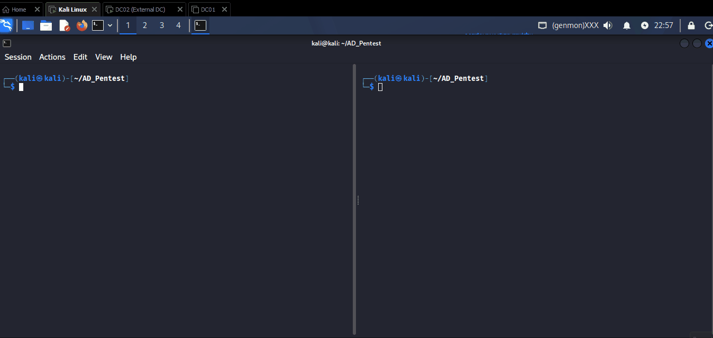

# 2.2.1 LLMNR/NBT-NS Poisoning Cont.

## Concept Of LLMNR Exploitation

<figure><figcaption></figcaption></figure>

**Step 1:** The client attempts to access a network resource such as `\\Share` and sends a request to the DNS server to resolve the hostname.

**Step 2:** The DNS server is unable to locate the requested resource and returns a response indicating that the hostname cannot be resolved.

**Step 3:** Since DNS resolution failed, the client falls back to LLMNR or NBT-NS and broadcasts a multicast request across the local network asking if any device knows the location of `\\Share`.

**Step 4:** The attacker, listening for these broadcast requests, responds before legitimate systems and falsely claims to own the requested resource. The attacker then requests authentication from the client.

**Step 5:** Trusting the response, the client automatically sends its NTLM challenge-response authentication data (Net-NTLMv2 hash) to the attacker's machine. The attacker can then attempt to crack the captured hash offline or use it in relay attacks against other systems.

This attack is particularly effective in Active Directory environments because Windows systems automatically use LLMNR and NBT-NS when DNS resolution fails, often resulting in credential leakage without any user interaction.

Attacker use **Responder** to poison LLMNR and NBT-NS resolution and capture the password hashes.

***

## Responder

[Responder](https://github.com/SpiderLabs/Responder) is a powerful network-based credential harvesting tool commonly used during internal penetration tests and Active Directory assessments. It listens for and responds to LLMNR, NBT-NS, and mDNS name resolution requests, allowing an attacker to impersonate requested hosts and capture NTLM authentication hashes from Windows systems.

The tool includes several built-in services such as SMB, HTTP, LDAP, FTP, and DCE-RPC, making it useful for a variety of credential capture and network poisoning attacks. Captured NTLM hashes can be cracked offline or relayed to other systems when conditions allow.

Due to its effectiveness and ease of use, Responder is one of the most widely used tools for credential harvesting, lateral movement, and Active Directory attack path discovery during internal network penetration testing.

***

## LLMNR/NBT-NS Poisoning through SMB

On Previous we see that the Share is available called 'Common'.&#x20;

> Note: Here notice that the SMB signing is enable and SMBv1 is disable.

<figure><figcaption></figcaption></figure>

Now start responder and wait for the victim to connect to the share:

<figure><figcaption></figcaption></figure>

<figure><figcaption></figcaption></figure>

Now, when the victim tries to access the share:

<figure><figcaption></figcaption></figure>

The Responder automatically capture **NTLM hashes:**

<figure><figcaption></figcaption></figure>

Now copy the hash to file and try to crack the hash offline using john or hashcat:

<figure><figcaption></figcaption></figure>

***

## SMB-Killer

SMB-Killer is a tool used during internal penetration tests to trigger NTLM authentication attempts from users on a network. It works by generating malicious files such as **SCF**, **URL**, and **XML** files that reference an attacker-controlled SMB share. When a victim browses, opens, or interacts with these files, Windows automatically attempts to connect to the remote SMB resource and sends NTLM authentication data.

SMB-Killer is commonly used alongside tools such as Responder or Inveigh to capture NTLM hashes or facilitate NTLM relay attacks. It is particularly useful in Active Directory environments for credential harvesting and identifying systems that automatically authenticate to network resources.

Now we can try LLMNR and NBT-NS poisoning using [SMB-Killer](https://github.com/overgrowncarrot1/SMB_Killer) and disabling SMB Signing and turn on SMBv1.

```bash
wget https://raw.githubusercontent.com/overgrowncarrot1/SMB_Killer/refs/heads/main/SMB_Killer.py
python3 SMB_Killer.py -l <LOCALHOST> -r <REMOTEHOST> -d <DOMAIN.NAME> -a <SHARENAME> -A -i <NETWORK_INTERFACE>
```

***

To disable SMB Signing and turn on SMBv1 (disabling SMBv2) we can copy the PowerShell code below.

```powershell

Set-ItemProperty -Path "HKLM:\SYSTEM\CurrentControlSet\Services\LanmanServer\Parameters" -Name "EnableSecuritySignature" -Value 0
Set-ItemProperty -Path "HKLM:\SYSTEM\CurrentControlSet\Services\LanmanServer\Parameters" -Name "RequireSecuritySignature" -Value 0
Set-ItemProperty -Path "HKLM:\SYSTEM\CurrentControlSet\Services\LanmanWorkstation\Parameters" -Name "EnableSecuritySignature" -Value 0
Set-ItemProperty -Path "HKLM:\SYSTEM\CurrentControlSet\Services\LanmanWorkstation\Parameters" -Name "RequireSecuritySignature" -Value 0
```

<figure><figcaption></figcaption></figure>

Now see that the SMB Signing is False now:

<figure><figcaption></figcaption></figure>

Now Start SMB Killer and wait for victim's tries to open or access shares.

<figure><figcaption></figcaption></figure>

when the victim tries to access the share the Responder poison the victim and capture the NTLMv2 hash:

<figure><figcaption></figcaption></figure>

We can also see that the some malicious evil files are also saved inside the share 'Common' folder which is help attacker to trigger authentication attempts from users who browse the share or folder. The goal is typically to induce Windows system to connect to an attacker-controlled server and send NTLM authentication data.

<figure><figcaption></figcaption></figure>

***

To re-enable SMB Signing (and enable SMBv2) we can copy the PowerShell script below. You should continue to keep Signing disabled until the end of the course.

```powershell

Set-ItemProperty -Path "HKLM:\SYSTEM\CurrentControlSet\Services\LanmanServer\Parameters" -Name "EnableSecuritySignature" -Value 1

Set-ItemProperty -Path "HKLM:\SYSTEM\CurrentControlSet\Services\LanmanServer\Parameters" -Name "RequireSecuritySignature" -Value 1

Set-ItemProperty -Path "HKLM:\SYSTEM\CurrentControlSet\Services\LanmanWorkstation\Parameters" -Name "EnableSecuritySignature" -Value 1

Set-ItemProperty -Path "HKLM:\SYSTEM\CurrentControlSet\Services\LanmanWorkstation\Parameters" -Name "RequireSecuritySignature" -Value 1

# Disable SMBv1

Disable-WindowsOptionalFeature -Online -FeatureName "SMB1Protocol" -Remove

# Verify SMBv2/3 is enabled (default in Windows 8+ / Server 2012+)

Set-SmbServerConfiguration -EnableSMB2Protocol $true -Force

Set-SmbServerConfiguration -EnableSMB1Protocol $false -Force

# Restart services to apply changes

Restart-Service -Name "LanmanServer" -Force

Restart-Service -Name "LanmanWorkstation" -Force
```

***

### Capturing NTLM Hashes from Web Requests with Responder

Responder can also capture NTLM authentication hashes through web-based requests. In environments where a user attempts to access a web application, file share, or internal resource using a hostname that cannot be resolved by DNS, Windows may fall back to LLMNR or NBT-NS for name resolution.

If Responder is running on the network, it can answer these requests and impersonate the requested host. The victim system may then attempt to authenticate automatically to Responder's rogue HTTP or SMB service, sending NTLM authentication data in the process.

This technique is commonly seen in phishing scenarios, misconfigured intranet environments, or situations where users access non-existent internal hosts. The captured NTLM hashes can later be cracked offline or used in NTLM relay attacks, depending on the target environment.

#### Start Responder for LLMNR/NBT-NS Poisoning

**Purpose:** This command starts Responder on the specified network interface and enables LLMNR, NBT-NS, and mDNS poisoning services. Responder listens for name resolution requests on the local network and responds as the requested host, allowing it to capture NTLM authentication attempts from Windows systems.

```bash
sudo responder -I eth0 -wdv
```

**Option Description:**

* `-I eth0` – Specifies the network interface Responder should listen on.
* `-w` – Starts the WPAD rogue proxy server to capture authentication attempts through WPAD requests.
* `-d` – Enables DHCP poisoning-related features and DHCP response handling.
* `-v` – Enables verbose mode, displaying detailed information about captured requests and authentication attempts.

<figure><figcaption></figcaption></figure>

***

### Reference:

* [https://www.hackingarticles.in/a-detailed-guide-on-responder-llmnr-poisoning/](https://www.hackingarticles.in/a-detailed-guide-on-responder-llmnr-poisoning/)
* [https://firecompass.com/attack-defend-llmnr-a-widespread-shadow-network-discovery-protocol/](https://firecompass.com/attack-defend-llmnr-a-widespread-shadow-network-discovery-protocol/)
