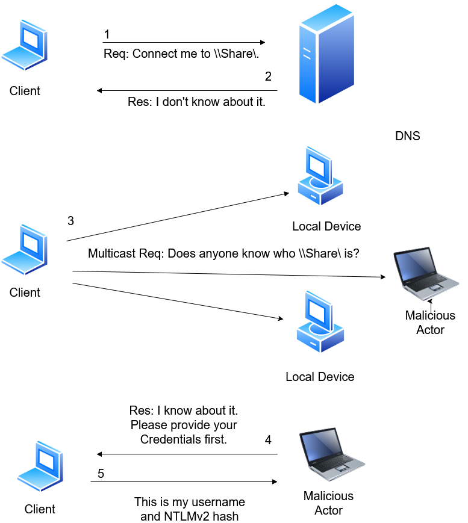

# 2.2.1 LLMNR/NBT-NS Poisoning Cont.

## Concept Of LLMNR Exploitation

<figure><figcaption></figcaption></figure>

**Step 1:** The client attempts to access a network resource such as `\\Share` and sends a request to the DNS server to resolve the hostname.

**Step 2:** The DNS server is unable to locate the requested resource and returns a response indicating that the hostname cannot be resolved.

**Step 3:** Since DNS resolution failed, the client falls back to LLMNR or NBT-NS and broadcasts a multicast request across the local network asking if any device knows the location of `\\Share`.

**Step 4:** The attacker, listening for these broadcast requests, responds before legitimate systems and falsely claims to own the requested resource. The attacker then requests authentication from the client.

**Step 5:** Trusting the response, the client automatically sends its NTLM challenge-response authentication data (Net-NTLMv2 hash) to the attacker's machine. The attacker can then attempt to crack the captured hash offline or use it in relay attacks against other systems.

This attack is particularly effective in Active Directory environments because Windows systems automatically use LLMNR and NBT-NS when DNS resolution fails, often resulting in credential leakage without any user interaction.

Attacker use **Responder** to poison LLMNR and NBT-NS resolution and capture the password hashes.

***

## Responder

[Responder](https://github.com/SpiderLabs/Responder) is a powerful network-based credential harvesting tool commonly used during internal penetration tests and Active Directory assessments. It listens for and responds to LLMNR, NBT-NS, and mDNS name resolution requests, allowing an attacker to impersonate requested hosts and capture NTLM authentication hashes from Windows systems.

The tool includes several built-in services such as SMB, HTTP, LDAP, FTP, and DCE-RPC, making it useful for a variety of credential capture and network poisoning attacks. Captured NTLM hashes can be cracked offline or relayed to other systems when conditions allow.

Due to its effectiveness and ease of use, Responder is one of the most widely used tools for credential harvesting, lateral movement, and Active Directory attack path discovery during internal network penetration testing.

***

## LLMNR/NBT-NS Poisoning through SMB

On Previous we see that the Share is available called 'Common':

<figure><figcaption></figcaption></figure>

Now start responder and wait for the victim to connect to the share:

<figure><figcaption></figcaption></figure>

<figure><figcaption></figcaption></figure>

Now, when the victim tries to access the share:

<figure><figcaption></figcaption></figure>

The Responder automatically capture **NTLM hashes:**

<figure><figcaption></figcaption></figure>

Now copy the hash to file and try to crack the hash offline using john or hashcat:

<figure><figcaption></figcaption></figure>
