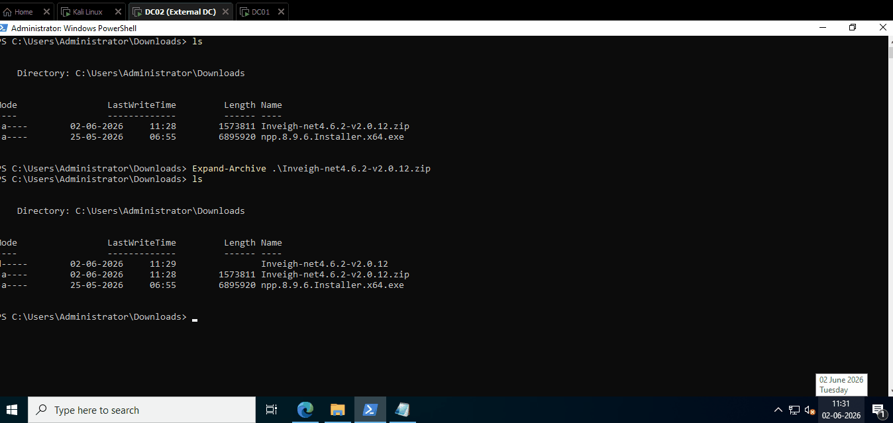

# 2.2.2 NTLM/NBT-NS using Inveigh

Inveigh is a PowerShell-based tool used during internal penetration tests and Active Directory assessments to capture user authentication attempts on Windows networks. It works by listening for and responding to name resolution requests such as LLMNR and NBT-NS, causing Windows systems to send NTLM authentication data to the attacker's machine.

The tool performs functions similar to Responder but runs natively on Windows, making it useful when an attacker has access to a Windows host inside the target network. Once authentication attempts are captured, the NTLM hashes can be cracked offline or used in other attacks such as NTLM relay.

Because of its ability to collect credentials and identify authentication traffic within a network, Inveigh is commonly used by penetration testers and red teamers during internal Active Directory engagements.



***

## Poison Network using Inveigh

Here we are using external domain (DC02) as a attacker machine and internal domain (DC01) as a victim machine.

> Note: LLMNR/NBT-NS is a local network protoco, so the both machine must be in the same network.

<figure><figcaption></figcaption></figure>

<figure><figcaption></figcaption></figure>

Now download the Inveigh tool zip file from github: [https://github.com/Kevin-Robertson/Inveigh/releases/download/v2.0.12/Inveigh-net10.0-v2.0.12.zip](https://github.com/Kevin-Robertson/Inveigh/releases/download/v2.0.12/Inveigh-net10.0-v2.0.12.zip)

<figure><figcaption></figcaption></figure>

Now before running the tool first we need to setup our previously stored evil malicious file from common shares  to trigger authentication attempts from users who browse the share or folder.

So open each file and change the IP to our attacker machine IP (192.168.0.112).

<figure><figcaption><p>@evil.scf</p></figcaption></figure>

<figure><figcaption><p>@evil.url</p></figcaption></figure>

<figure><figcaption><p>@evil.xml</p></figcaption></figure>

Now Unzip the Inveigh:

```powershell
Expand-Archive .\Inveigh-net10.0-v2.0.12.zip
ls
```

<figure><figcaption></figcaption></figure>

Now start the Inveigh tool and for the target machine (user) to connect to the share:

```
.\Inveigh.exe
```

<figure><figcaption></figcaption></figure>
