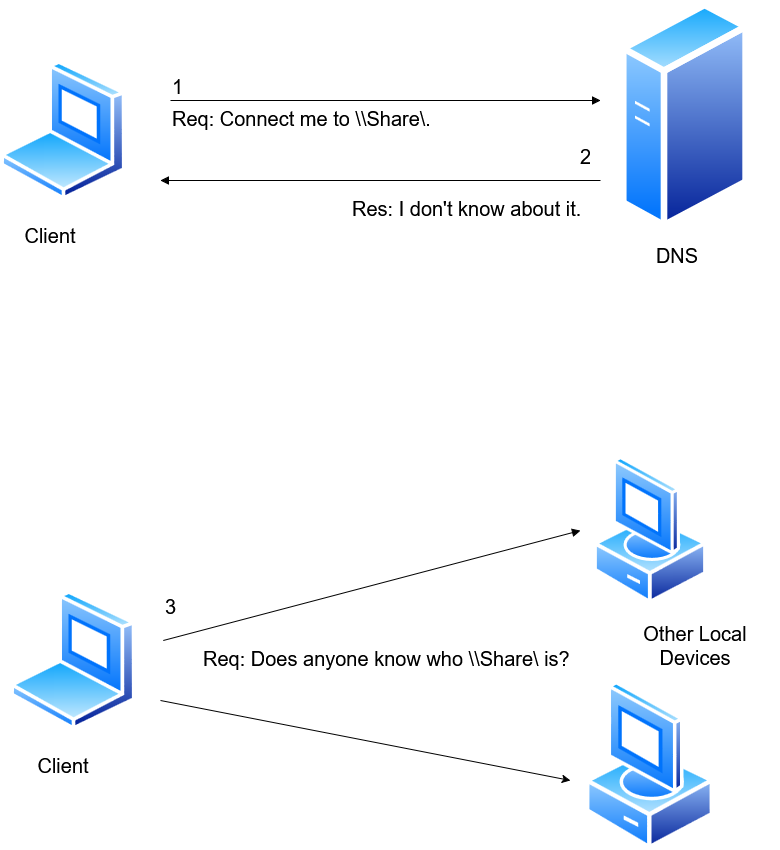

# 2.2 LLMNR/NBT-NS Poisoning

LLMNR/NBT-NS Poisoning is a common credential harvesting attack used in internal network and Active Directory environments.&#x20;

Before understanding how LLMNR/NBT-NS Poisoning works, it is important to first understand the role of network name resolution and discovery protocols such as LLMNR, NBT-NS, mDNS, and DHCP, as these protocols play a key role in how devices communicate and identify each other within a local network environment.

## Understanding LLMNR

**Link-Local Multicast Name Resolution** (LLMNR) is a Windows name resolution protocol designed to resolve names of neighboring computers in the absence of a Domain Name System (DNS) server. When a Windows device fails to resolve a name using DNS, it sends an LLMNR multicast query to the local network. This multicast query is sent to all devices on the subnet, asking if any device knows the resolution for the requested name.

LLMNR works over UDP port `5355` and supports both IPv4 and IPv6 networks. It is commonly enabled by default on Windows systems and is mainly used in small or local networks where DNS resolution is unavailable.

For example, if a user tries to access a shared folder like `\\fileserver` and DNS cannot resolve the hostname, Windows automatically sends an LLMNR multicast request across the network. Any system listening on the network can respond to that request.

<figure><figcaption></figcaption></figure>

### When Will LLMNR Work?

* **Local Network:** LLMNR is designed for local networks, and it works well within the same subnet or broadcast domain.
* **DNS Failure:** LLMNR is used as a fallback mechanism when traditional DNS resolution fails. If a device cannot resolve a hostname through DNS, it may use LLMNR to try and resolve the name locally within the same subnet.

### When Will LLMNR Not Work?

* **Across Subnets:** LLMNR is limited to the local subnet or broadcast domain. It doesn’t traverse routers or subnets, so it won’t work for devices on different subnets.
* **Disabled or Blocked:** LLMNR might not work if it’s explicitly disabled on a device or blocked by network policies. Some security policies or firewalls may block LLMNR traffic.
* **IPv6 Networks:** LLMNR is primarily designed for IPv4 networks. In IPv6 networks, though LLMNR can be employed in the environment, the multicast-based Neighbor Discovery Protocol (NDP) is used instead as it is a standard protocol for IPv6 Networks.
* **Security Concerns:** LLMNR may pose some security risks, as it operates in a broadcast/multicast fashion, making it susceptible to certain types of attacks such as spoofing or poisoning. For this reason, in some security-conscious environments, LLMNR might be disabled.
* **Alternative Mechanisms:** In environments where LLMNR is not suitable or disabled, other mechanisms like NetBIOS or mDNS (Multicast DNS) may be used for local name resolution.

***

## Understanding NBT-NS

NBT-NS is an older Windows name resolution protocol used before LLMNR became common. It resolves NetBIOS names to IP addresses within local networks, similar to how DNS resolves domain names on the internet.

NBT-NS operates over UDP port `137` and is part of the older NetBIOS over TCP/IP system used by Windows networking. Each Windows machine is assigned a unique NetBIOS name that can be used for communication and resource sharing.

When DNS fails, Windows systems may still fall back to NBT-NS to locate hosts on the local network. Similar to LLMNR, the system broadcasts a request asking which device owns a specific NetBIOS name.

***

### Understanding mDNS (Multicast DNS)

Multicast DNS (mDNS) is a protocol used for local network name resolution without requiring a traditional DNS server. Instead of querying a centralized DNS server, mDNS sends multicast requests to all devices on the local network. Consequently, once the sender establishes a connection with the recipients, all participants receive the name-to-IP mapping update and can store it in their mDNS cache.

mDNS operates over UDP port `5353` and is commonly used by Apple devices, Linux systems, IoT devices, printers, and other systems supporting Zero Configuration Networking (Zeroconf).

For example, devices can automatically discover systems such as:

* Printers
* Smart TVs
* Apple AirPlay devices
* Shared folders
* Network services

Hostnames in mDNS usually end with `.local`, such as:

```
printer.local
```

When a device sends an mDNS query, all devices on the local network receive the request. The device that owns the requested hostname responds with its IP address.

***

### DHCP (Dynamic Host Configuration Protocol)

DHCP is a network management protocol used to automatically assign IP addresses and network configuration settings to devices on a network.

Instead of manually configuring every system, DHCP automatically provides:

* IP Address
* Subnet Mask
* Default Gateway
* DNS Server
* Lease Time

DHCP operates using:

* UDP port `67` (Server)
* UDP port `68` (Client)

When a device connects to a network, it usually follows a four-step DHCP process known as DORA:

1. **Discover** – The client broadcasts a request searching for a DHCP server.
2. **Offer** – The DHCP server offers an available IP address.
3. **Request** – The client requests the offered IP address.
4. **Acknowledge** – The server confirms the assignment.

In Active Directory environments, DHCP helps manage large numbers of systems efficiently by automating network configuration.
