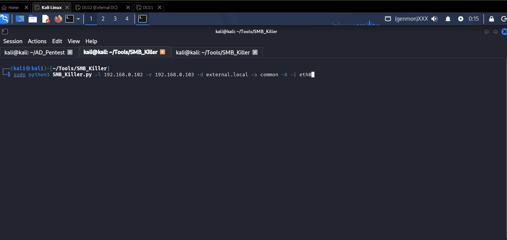
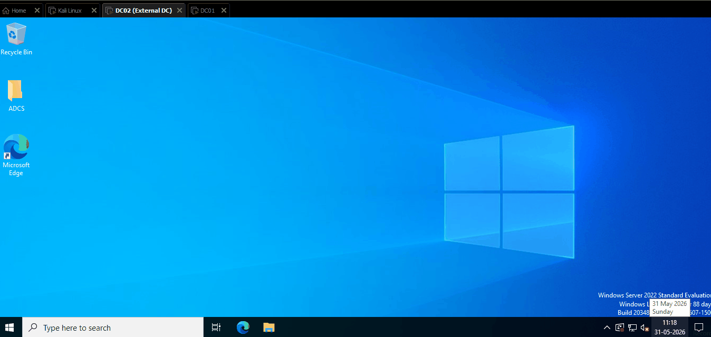
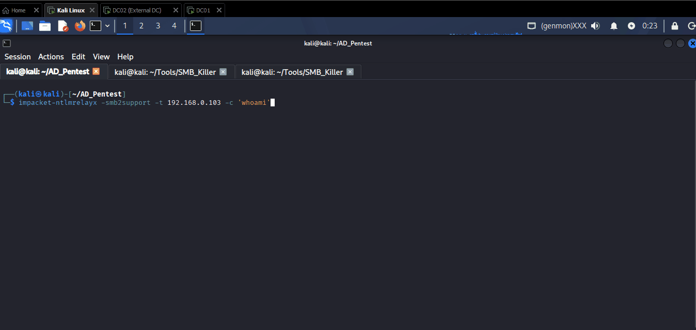

# NTLM Relay Attacks

An NTLM relay attack is a man-in-the-middle (MitM) technique that allows an attacker to intercept a victim’s NTLM authentication and “relay” it to a different server. This enables the attacker to gain unauthorized access to the target server by impersonating the victim, all without ever needing to crack the user’s password.

## **Definition and Core Concepts**

An NTLM relay attack is a type of credential relay attack that exploits the NTLM (NT LAN Manager) authentication protocol. The attacker positions themselves between a client and a legitimate server, intercepts the authentication exchange, and forwards it to an unsuspecting third-party server to gain unauthorized access.

#### **NTLM Authentication Process**

To read about NTLM Authentication process check [here](../windows-authentication-methods/2.netntlm-authentication.md).

***

## **How It Works**

An NTLM relay attack requires the attacker to position themselves as a man-in-the-middle between a victim and a target server. The attack exploits the trust relationship inherent in the NTLM protocol.

#### **Man-in-the-Middle Positioning**

The attacker must first intercept the victim’s network traffic. This can be achieved through techniques like ARP spoofing, DNS poisoning, or by leveraging vulnerable protocols like Link-Local Multicast Name Resolution (LLMNR) and NetBIOS Name Service (NBT-NS) that allow a host to impersonate a requested service.

LLMNR and NBT-NS are particularly useful for attackers because they respond to name resolution requests when DNS fails. An attacker on the same network segment can respond to these requests and direct traffic to their machine.

#### **The Relay Process**

The attack follows a precise sequence of message forwarding:

* **Step 1**: The victim client attempts to access a service, but due to the attacker’s MitM position, the request goes to the attacker’s machine.
* **Step 2**: The attacker forwards the victim’s initial authentication request to an entirely different, unsuspecting target server.
* **Step 3**: The target server, believing it’s communicating with the legitimate client, sends a Challenge to the attacker.
* **Step 4**: The attacker forwards the Challenge to the victim.
* **Step 5**: The victim computes a valid Authenticate response to the challenge and sends it back to the attacker.
* **Step 6**: The attacker relays this valid Authenticate response to the target server. The target server validates the response, and the attacker is successfully authenticated as the victim.

The attacker has now gained access to the target server with the victim’s privileges. The victim is unaware that their authentication was used on another machine.

The attack succeeds because the NTLM protocol doesn’t include adequate channel binding or mutual authentication mechanisms to verify the intended communication endpoints.

***

## Requirements for an NTLM Relay Attack

For an NTLM Relay attack to be successful, several conditions must be met within the target environment.

#### 1. SMB Signing Must Not Be Enforced

SMB signing is a security feature that verifies the integrity of SMB communications. During an NTLM Relay attack, the attacker intercepts an authentication request and forwards it to another system. Because the request is modified and relayed, the attacker cannot generate a valid SMB signature on behalf of the victim.

If SMB signing is enforced on the target server, the relayed authentication request will fail and the server will reject the connection. Therefore, SMB signing must either be disabled or enabled but not enforced on the target system.

```powershell
#To turn off SMB Signing
Set-SmbServerConfiguration -RequireSecuritySignature $false
Set-SmbClientConfiguration -RequireSecuritySignature $false

#To turn on SMB Signing
Set-SmbServerConfiguration -RequireSecuritySignature $true
Set-SmbClientConfiguration -RequireSecuritySignature $true
```

#### 2. The Relayed Account Must Have Appropriate Permissions

Successfully relaying authentication does not automatically grant access to a target system. The account being relayed must already have permissions on the destination host.

For example, if the relayed account is a local administrator on the target server, the attacker may be able to execute commands, dump credentials, or gain remote access. If the account has only limited privileges, the impact of the relay attack will also be limited.

#### 3. Identifying Suitable Targets

Before gaining a foothold in Active Directory, attackers often have limited visibility into which users have administrative access to specific systems. As a result, some trial and error may be required to identify suitable relay targets.

In real-world engagements, attackers who already have access to the domain typically perform Active Directory enumeration first to identify privileged accounts, local administrator relationships, and systems where NTLM Relay attacks are most likely to succeed.

***

## NTLM Relay Attacks

To perform NTLM relay into our local lab, we first need to disable SMB Singing on the both Internal and external machine:

&#x20;Use the following PowerShell script to disable SMB Signing:

```powershell
#To turn off SMB Signing
Set-SmbServerConfiguration -RequireSecuritySignature $false
Set-SmbClientConfiguration -RequireSecuritySignature $false
```

<figure><figcaption><p>DC02</p></figcaption></figure>

<figure><figcaption><p>DC01</p></figcaption></figure>

> Note: Connect both internal and external domain into same virtual network (Bridged)

Now from attacker machine (Linux machine) run nxc to check the SMB signing option:

```
nxc smb <NETWORK/MASK>
```

<figure><figcaption></figcaption></figure>

Here see the result that the both DC01 and DC02 has SMB signing False.

Now start SMB Killer to perform LLMNR and capture NTLM hash:

```bash
python3 SMB_Killer.py -l <LOCALHOST> -r <REMOTEHOST> -d <DOMAIN.NAME> -a <SHARENAME> -A -i <NETWORK_INTERFACE>
```

<figure><figcaption></figcaption></figure>

#### NTLM Relay&#x20;

Here we are using NTLMRelayX to perform NTLM Relay attack.

[NTLMRelayX](https://github.com/fortra/impacket/blob/master/examples/ntlmrelayx.py) is a tool in the Impacket suite used to perform NTLM relay attacks on internal networks. It captures NTLM authentication requests (often via tools like Responder) and relays them to another target, typically an SMB or HTTP service, to authenticate as the victim. If the relayed user has privileges on the target system, NTLMRelayX can execute commands, dump SAM hashes, or even create backdoors — all without cracking the password.

Now we move previously stored evil files from 'Common' share folder to 'SharedData\Confidential' folder:

> Evil Files: which we have from SMB Killer from previous LLMNR poison attack. Which help us to trigger authentication attempts from users who browse the share or folder.&#x20;

<figure><figcaption></figcaption></figure>

Now run NTLMRelayX and wait for the user to browse the SharedData\Confidential folder.

#### Start NTLM Relay and Execute a Command

**Purpose:** This command starts `ntlmrelayx` and waits for incoming NTLM authentication attempts. When a victim authenticates to the attacker machine, the captured authentication is relayed to the target host. If the relayed account has sufficient privileges on the target system, the specified command is executed.

```bash
impacket-ntlmrelayx -smb2support -t <INTERNAL-DOMAIN-IP> -c 'whoami'
```

* `-smb2support` enables SMBv2 support.
* `-t` specifies the target host that will receive the relayed authentication.
* `-c` specifies the command to execute on the target after successful authentication.

<figure><figcaption></figcaption></figure>

### Start NTLM Relay Listener

**Purpose:** This command starts `ntlmrelayx` in relay mode and listens for incoming NTLM authentication attempts. Instead of executing a specific command, it relays captured authentication to the target host and attempts to establish access using the privileges of the relayed account.

```bash
impacket-ntlmrelayx -smb2support -t <INTERNAL-DOMAIN-IP>
```

* `-smb2support` enables SMBv2 support.
* `-t` specifies the target host for the relayed authentication.

If the target system is vulnerable to NTLM Relay and the relayed account has sufficient permissions, access to the target system may be obtained without knowing the user's password.

<figure><figcaption></figcaption></figure>

<figure><figcaption></figcaption></figure>

We successfully dump SAM hashes of Internal Domain system (DC01).

***

### References

* [https://www.vaadata.com/en/blog/understanding-ntlm-authentication-and-ntlm-relay-attacks/](https://www.vaadata.com/en/blog/understanding-ntlm-authentication-and-ntlm-relay-attacks/)
* [https://www.hackingarticles.in/domain-escalation-petitpotam-ntlm-relay-to-adcs-endpoints/](https://www.hackingarticles.in/domain-escalation-petitpotam-ntlm-relay-to-adcs-endpoints/)
* [https://www.hackingarticles.in/adcs-esc11-relaying-ntlm-to-icpr/](https://www.hackingarticles.in/adcs-esc11-relaying-ntlm-to-icpr/)
* [https://www.hackingarticles.in/adcs-esc8-ntlm-relay-to-ad-cs-http-endpoints/](https://www.hackingarticles.in/adcs-esc8-ntlm-relay-to-ad-cs-http-endpoints/)
