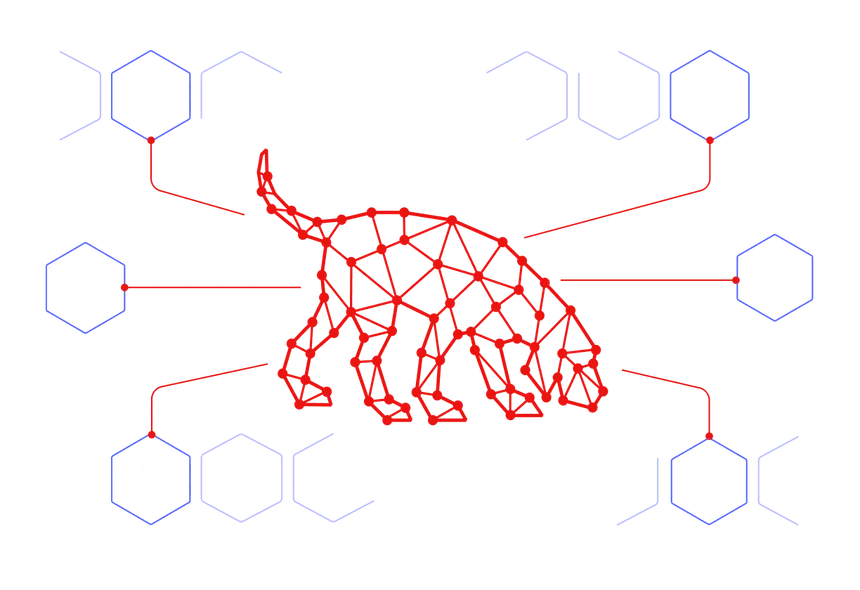

# 3.4 Abuse WriteDACL

**WriteDACL** is an Active Directory permission that allows a user to modify the Access Control List (ACL) of an object. An attacker with this permission can add new Access Control Entries (ACEs) and grant themselves additional rights, such as **GenericAll**, **GenericWrite**, or password reset permissions. Because it allows modification of object permissions, WriteDACL is commonly abused to gain full control over users, groups, computers, or other Active Directory objects, often leading to privilege escalation.

***

## Target

After gaining access to the `bruce.wayne` account, BloodHound analysis revealed that `bruce.wayne` has **WriteDACL** permission over the `harley.quinn` user account. This permission allows us to modify the Access Control List (ACL) of the target object and grant additional privileges to ourselves. By abusing this permission, we can assign rights such as `GenericAll` over the `harley.quinn` account, ultimately gaining full control of the user object.

<figure><figcaption></figcaption></figure>

***

## Exploit

To view the available abuse methods, select the **WriteDacl** edge in BloodHound and review the **Linux Abuse** section.

<figure><figcaption></figcaption></figure>

#### Modify an Active Directory Object's ACL and Grant Full Control

**Purpose:**\
This command uses Impacket's `dacledit` to modify the Discretionary Access Control List (DACL) of a target Active Directory object. It grants the specified principal `FullControl` permissions over the target object, allowing the principal to manage nearly all aspects of that object.

```bash
impacket-dacledit -action 'write' -rights 'FullControl' -principal <'ControlledUser'> -target <'TargetUser'>
```

<figure><figcaption></figcaption></figure>

> Note: If we have only NT Hash of Controlled User then we use this command:
>
> ```bash
> impacket-dacledit -action write -rights FullControl -principal '<ControlledUser>' -target '<TargetUser>' -dc-ip <DOMAIN_CONTROLLER_IP> -hashes <LMHASH>:<NTHASH> '<DOMAIN.NAME>/<ControlledUser>'
> ```

#### Abuse GenericAll Permission

After abusing the **WriteDACL** permission, we successfully granted **GenericAll (Full Control)** rights over the `harley.quinn` user account to `bruce.wayne`.

With **GenericAll**, we have complete control over the target account and can perform several abuse techniques. BloodHound highlights multiple attack paths that can be leveraged, including **Targeted Kerberoasting** and **ForceChangePassword**.

<figure><figcaption></figcaption></figure>

Now we will abuse the **Targeted Kerberoasting** attack path. This technique involves temporarily assigning a Service Principal Name (SPN) to the target account, requesting a Kerberos service ticket for that SPN, and extracting a crackable Kerberos hash. If the target account uses a weak password, the hash can be cracked offline to recover the account's plaintext credentials.

#### Perform a Targeted Kerberoasting Attack

**Purpose:**\
This command uses the [`targetedKerberoast.py`](https://github.com/ShutdownRepo/targetedKerberoast) utility to identify and request Kerberos service tickets for accounts that are suitable for Kerberoasting within an Active Directory environment. The tool focuses on accounts that can be modified by the authenticated user and may temporarily assign a Service Principal Name (SPN) to facilitate security testing of Kerberos authentication configurations.

```bash
targetedKerberoast.py -v -d <'Domain.Name'> -u <'ControlledUser'> -p <'ItsPassword'>
```

<figure><figcaption></figcaption></figure>

After successfully performing the Targeted Kerberoasting attack, we obtained the Kerberos service ticket hash for the `harley.quinn` account. The extracted hash should be saved to a file so it can be cracked offline using password-cracking tools.

```bash
echo '<KERBEROS_HASH>' > user_krb.hash
```

#### Crack the Hash Using John the Ripper

```bash
john user_krb.hash --wordlist=/usr/share/wordlists/rockyou.txt
john --show user_krb.hash
```

<figure><figcaption></figcaption></figure>

#### Crack the Hash Using Hashcat

```bash
hashcat -m 13100 user_krb.hash /usr/share/wordlists/rockyou.txt
hashcat -m 13100 user_krb.hash --show
```

***

## Reference

* [https://www.hackingarticles.in/impacket-for-pentester-dacledit/](https://www.hackingarticles.in/impacket-for-pentester-dacledit/)
*
