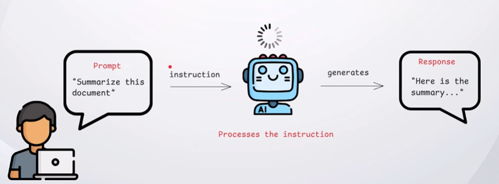
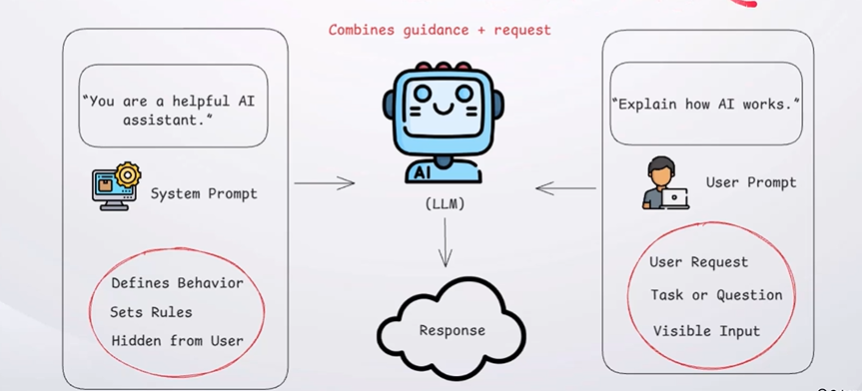
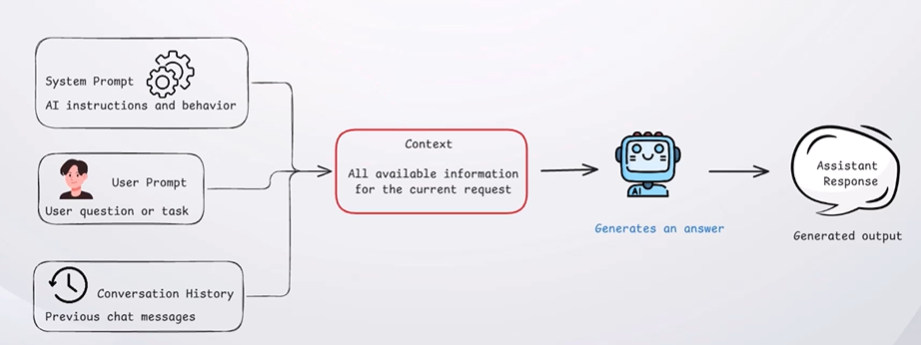
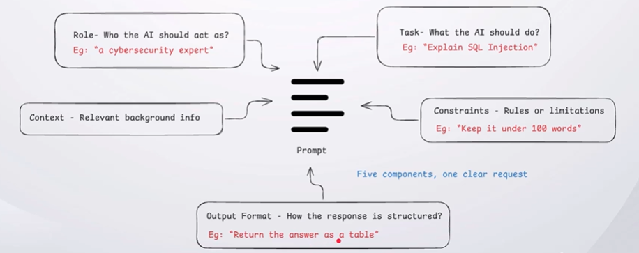
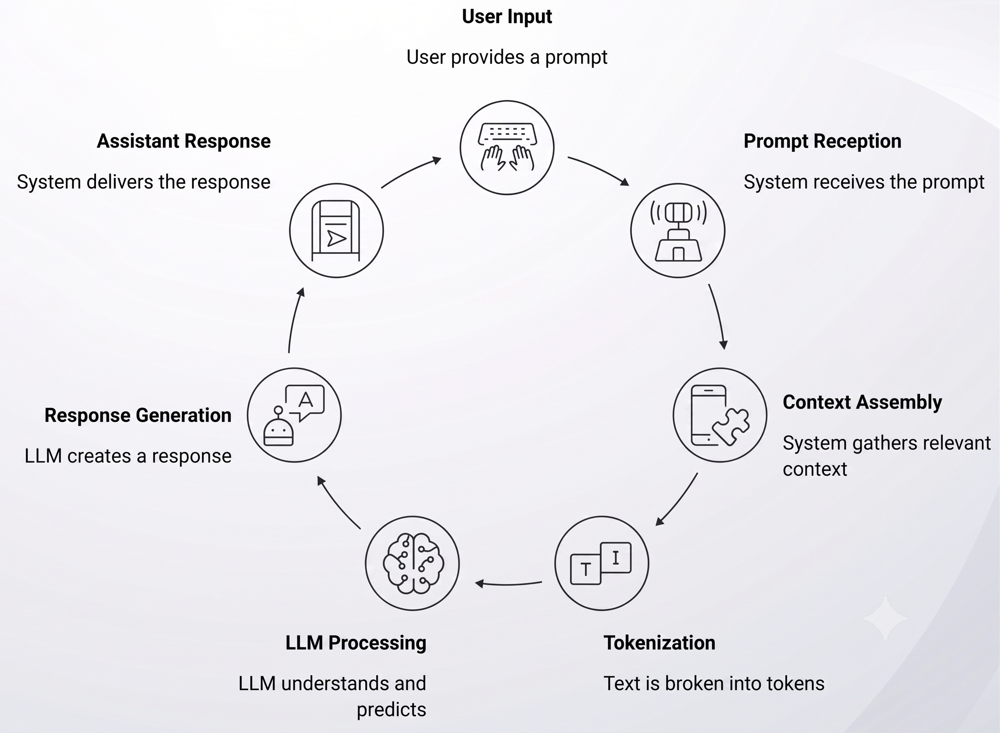

## What is a Prompt?

A prompt is the input or instruction given to an AI model to guide its response.

## Types of Prompts

Prompts can come from the system or the user, each serving a different purpose.

## What is a Context?

Context is the information the AI uses to understand and respond to a prompt.

## Components of a Prompt

A well-structured prompt combines key components to guide the AI toward the desired response.

## Prompt LifeCycle

---

[[AI LLM Security]]
