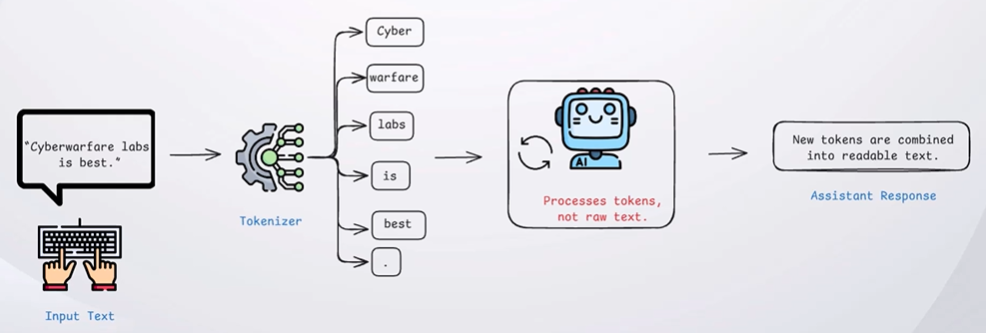
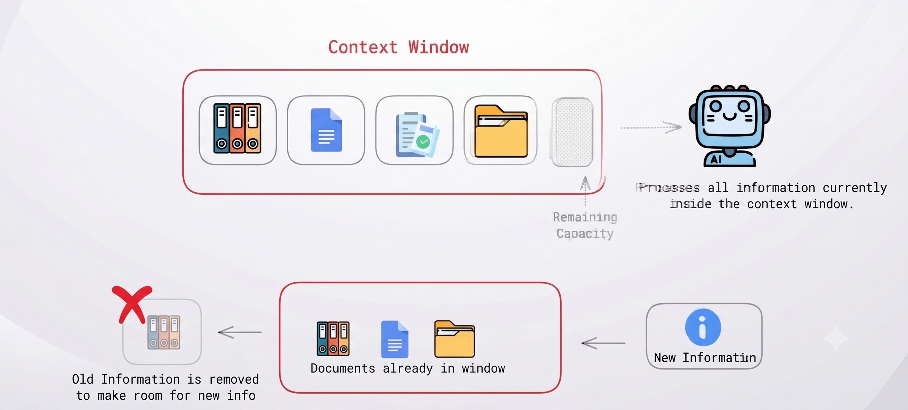
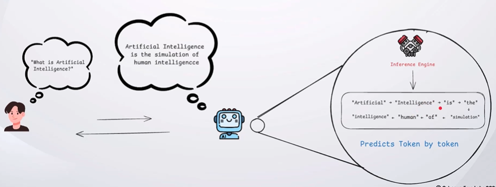
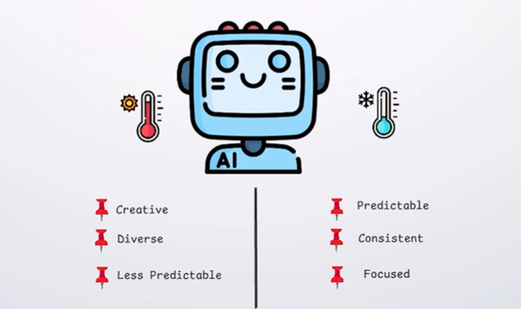
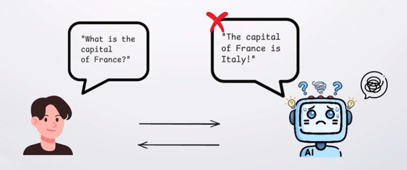

## What are Tokens?

An LLM splits text into small units called tokens to understand and generate responses.

## What is an Context Window?

A Context Window is the maximum amount of information an LLM can process at one time.

## Inference

Inference is the process of generating a response by predicting one token at a time.

## Temperature

Temperature controls how predictable or creative an LLM's responses are.

## Hallucination

Hallucination occur when an LLM generates information that is incorrect or fabricated while presenting it as if it were accurate.

