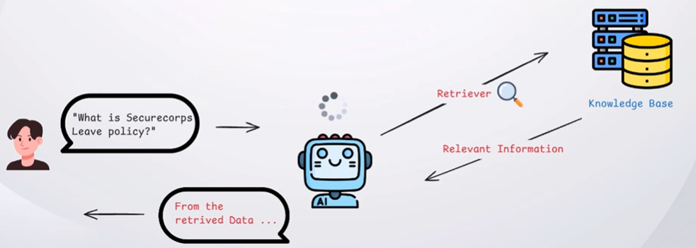
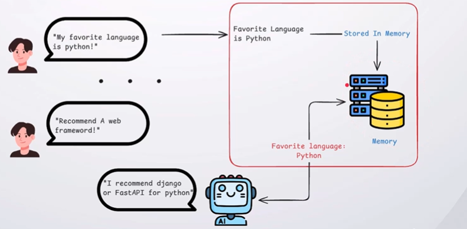
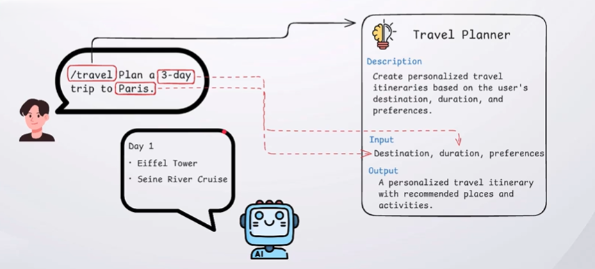
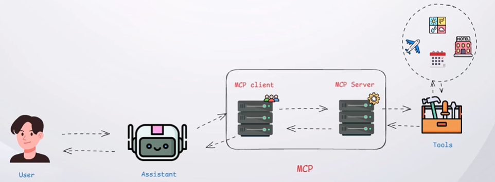
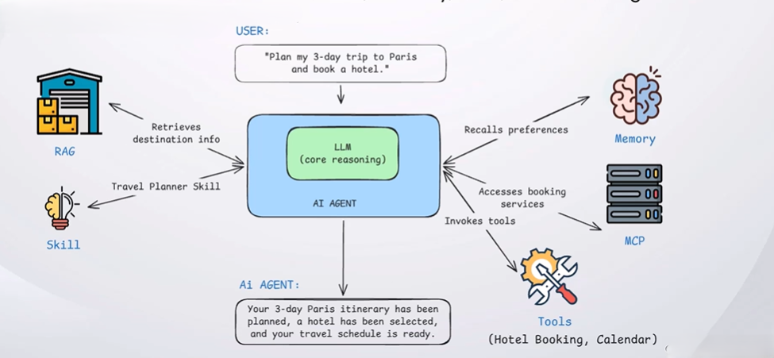

## RAG

Retrieval Augmented Generation, technology that enables LLMs to retrieve information from external sources before generating a response, helping reduce hallucinations.

## Memory

It Enables AI System to retain relevant information and add it to the context for future responses.

## Skills

A Skill enables an AI system to perform a specific task using predefined instructions and capabilities.

## Tools

Tools enables an LLM to interact with external systems and perform actions beyond generating text.

## MCP

Model Context Protocol (MCP) is a standardized protocol that enables AI systems to communicate with external tools and services.

## AI Agent

An AI Agent is a system that uses an LLM, Memory, Tools and Reasoning to autonomously accomplish tasks.

---

[[AI LLM Security]]
