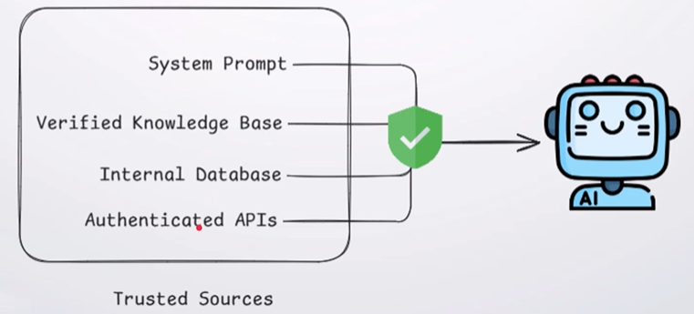
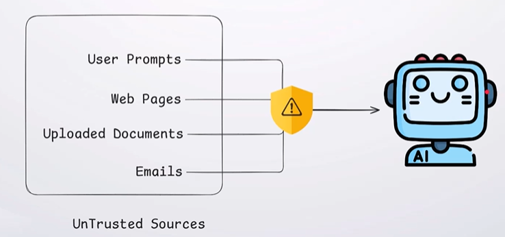
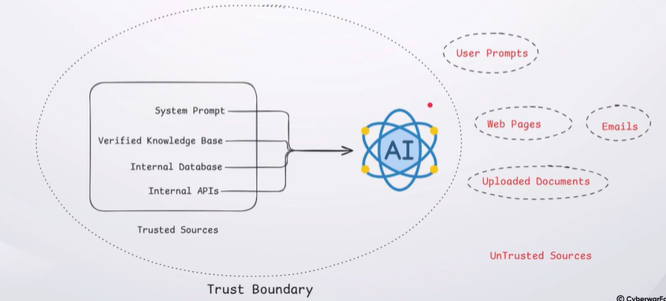
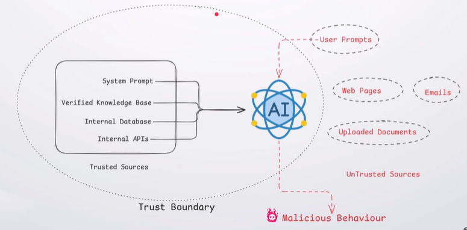

## Trusted Data

Trusted data originates from verified sources and is intended to guide the AI's behavior and decisions.

---
## Untrusted Data

Untrusted data comes from users or external sources and should never be trusted without validation.

---
## Trusted vs. Untrusted Data

Trusted data can be relied upon, while untrusted data should not be trusted by default; AI systems should be designed to maintain this distinction.

---
## Trust boundary

A trust boundary is the separation between trusted and untrusted data. If untrusted data crosses this boundary and is treated as trusted, it can lead to AI security attacks.

---
## Why Trust Boundary Mattes?

When untrusted data crosses a trust boundary and is treated as trusted, it can influence AI behavior and lead to security attacks.

