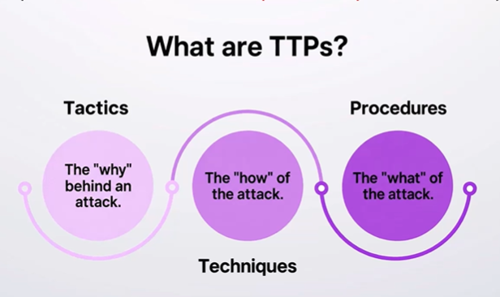
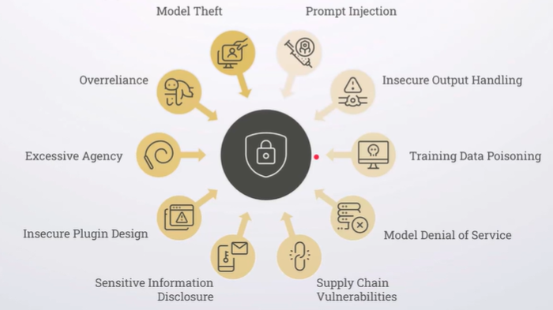
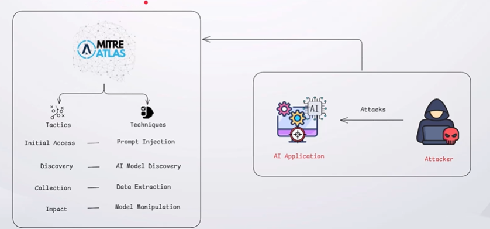
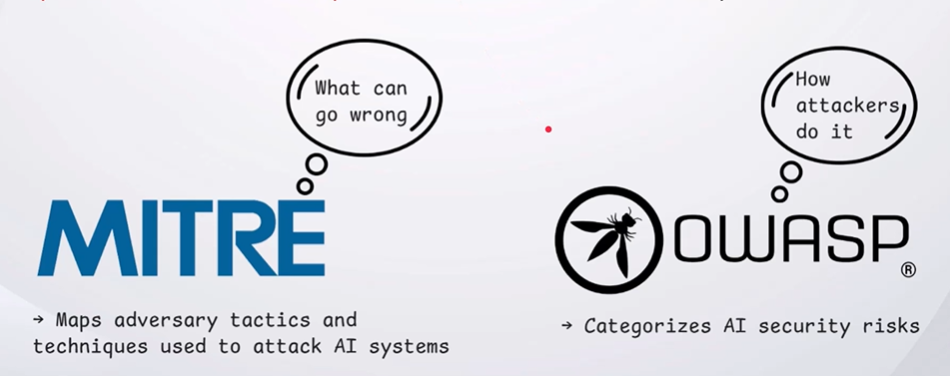

## Tactics, Techniques & Procedures [TTP]

**Tactics** describe what an attacker wants to achieve.
**Techniques** explain how they achieve it.
**Procedures** describe the specific steps used to carry out the attack.

---
## OWASP Top 10 for LLM

OWASP is a nonprofit organization that provides security resources and frameworks to help identify and address applications security risks.

The OWASP top 10 for LLM applications categorized the ten most critical security risks affecting LLM-based applications.

---
## MITRE

A nonprofit organization that develops frameworks and knowledge bases for understanding, classifying, and analyzing behavior and cybersecurity threats.

---
## MITRE ATLAS

MITRE ATLAS is a knowledge base that maps adversary tactics and techniques  used to attack AI and machine learning systems.

---
## OWASP Top 10 LLM vs MITRE ATLES

OWASP Top 10 for LLM applications categorizes AI security risks, while MITRE ATLAS maps the tactics and techniques adversaries use to attack AI systems.

