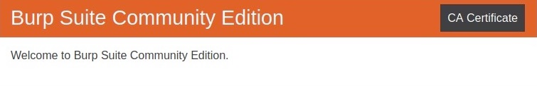
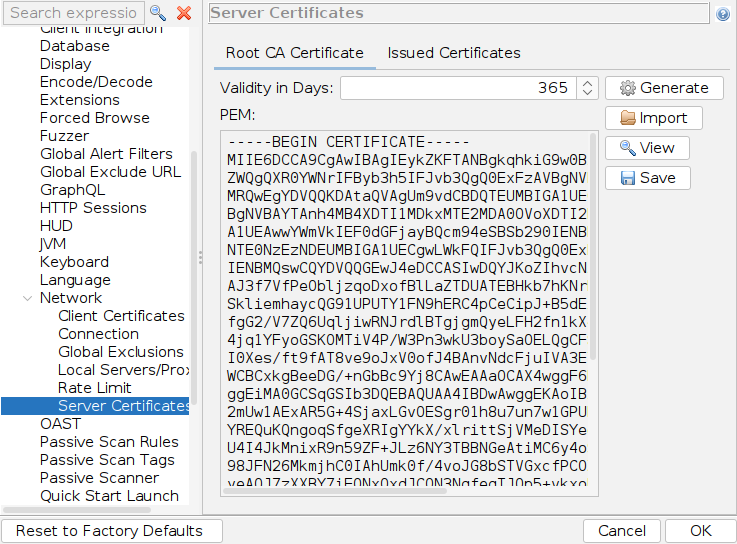

# 3.2 Proxy Setup

### Installing CA Certificate

We can install Burp's certificate once we select Burp as our proxy in `Foxy Proxy`, by browsing to `http://burp`, and downloading the certificate from there by clicking on `CA Certificate`:

To get ZAP's certificate, we can go to (`Tools>Options>Network>Server Certificates`), then click on `Save`:

