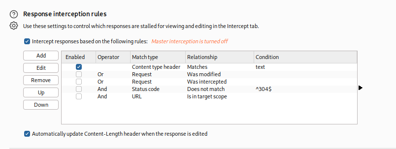
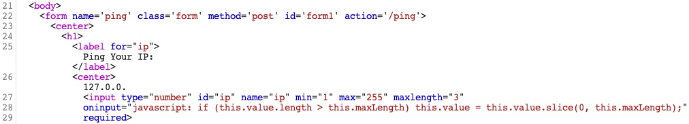

# 3.3 Intercepting Responses

### Burp

In Burp, we can enable response interception by going to (`Proxy>Proxy settings`) and enabling `Intercept Response` under `Response interception rules`:

After that, we can enable request interception once more and refresh the page with \[`CTRL+SHIFT+R`] in our browser (to force a full refresh). When we go back to Burp, we should see the intercepted request, and we can click on `forward`. Once we forward the request, we'll see our intercepted response:

***

