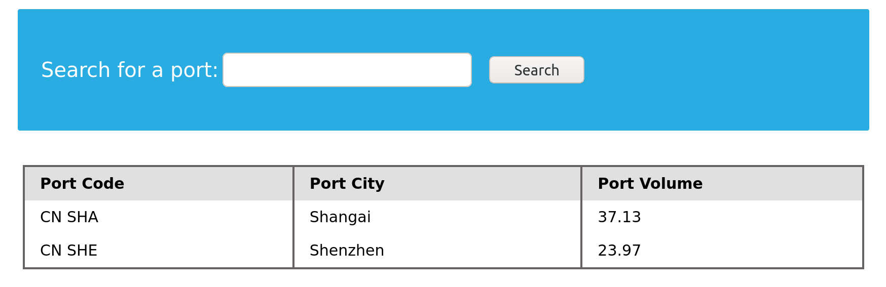

---
layout:
  width: wide
  title:
    visible: true
  description:
    visible: false
  tableOfContents:
    visible: true
  outline:
    visible: true
  pagination:
    visible: true
  metadata:
    visible: false
---

# 4.6 DNS Zone Transfers

DNS zone transfers, also known as AXFR (Asynchronous Full Transfer) requests, offer a potential goldmine of information for web reconnaissance. A zone transfer is a mechanism for replicating DNS data across servers. When a zone transfer is successful, it provides a complete copy of the DNS zone file, which contains a wealth of details about the target domain.

<figure><figcaption></figcaption></figure>

**1. Zone Transfer Request (AXFR)**\
The secondary DNS server asks the primary DNS server for a copy of the domain’s DNS data. It sends a special request called **AXFR**, which means “send me the full zone.”

**2. SOA Record Transfer**\
The primary server first sends the **SOA (Start of Authority)** record. This record tells the secondary server important details like the zone version (serial number). The secondary server uses this to check whether the data is new or already up to date.

**3. DNS Records Transmission**\
After that, the primary server starts sending **all DNS records** in the zone. These include records for IP addresses, mail servers, subdomains, and name servers. The records are sent one by one until everything is copied.

**4. Zone Transfer Complete**\
When all DNS records have been sent, the primary server indicates that the transfer is finished. This tells the secondary server that it now has the complete DNS zone data.

**5. Acknowledgement (ACK)**\
Finally, the secondary server sends a confirmation message back to the primary server. This confirms that the zone data was received successfully and the transfer process is complete.

This zone file lists all the domain's subdomains, their associated IP addresses, mail server configurations, and other DNS records. This is akin to obtaining a blueprint of the target's DNS infrastructure for a reconnaissance expert.

To attempt a zone transfer, you can use the `dig` command with the `axfr` (full zone transfer) option. For example, to request a zone transfer from the DNS server `ns1.example.com` for the domain `example.com`, you would execute:

```bash
# Syntax: dig axfr <@NS_Server> <@Domain>
dig axfr @ns1.example.com example.com 
```

However, zone transfers are not always permitted. Many DNS servers are configured to restrict zone transfers to authorized secondary servers only. Misconfigured servers, though, may allow zone transfers from any source, inadvertently exposing sensitive information.

```bash
SubhaDip03@htb[/htb]$ dig axfr @nsztm1.digi.ninja zonetransfer.me

; <<>> DiG 9.18.12-1~bpo11+1-Debian <<>> axfr @nsztm1.digi.ninja zonetransfer.me
; (1 server found)
;; global options: +cmd
zonetransfer.me.	7200	IN	SOA	nsztm1.digi.ninja. robin.digi.ninja. 2019100801 172800 900 1209600 3600
zonetransfer.me.	300	IN	HINFO	"Casio fx-700G" "Windows XP"
zonetransfer.me.	301	IN	TXT	"google-site-verification=tyP28J7JAUHA9fw2sHXMgcCC0I6XBmmoVi04VlMewxA"
zonetransfer.me.	7200	IN	MX	0 ASPMX.L.GOOGLE.COM.
...
zonetransfer.me.	7200	IN	A	5.196.105.14
zonetransfer.me.	7200	IN	NS	nsztm1.digi.ninja.
zonetransfer.me.	7200	IN	NS	nsztm2.digi.ninja.
_acme-challenge.zonetransfer.me. 301 IN	TXT	"6Oa05hbUJ9xSsvYy7pApQvwCUSSGgxvrbdizjePEsZI"
_sip._tcp.zonetransfer.me. 14000 IN	SRV	0 0 5060 www.zonetransfer.me.
14.105.196.5.IN-ADDR.ARPA.zonetransfer.me. 7200	IN PTR www.zonetransfer.me.
asfdbauthdns.zonetransfer.me. 7900 IN	AFSDB	1 asfdbbox.zonetransfer.me.
asfdbbox.zonetransfer.me. 7200	IN	A	127.0.0.1
asfdbvolume.zonetransfer.me. 7800 IN	AFSDB	1 asfdbbox.zonetransfer.me.
canberra-office.zonetransfer.me. 7200 IN A	202.14.81.230
...
;; Query time: 10 msec
;; SERVER: 81.4.108.41#53(nsztm1.digi.ninja) (TCP)
;; WHEN: Mon May 27 18:31:35 BST 2024
;; XFR size: 50 records (messages 1, bytes 2085)
```
