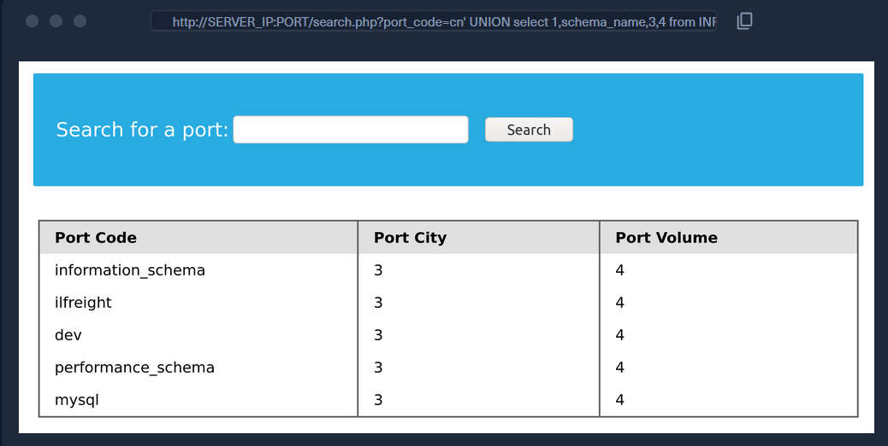

---
layout:
  width: wide
  title:
    visible: true
  description:
    visible: false
  tableOfContents:
    visible: true
  outline:
    visible: true
  pagination:
    visible: true
  metadata:
    visible: false
  tags:
    visible: true
---

# 8.13 Database Enumeration

In the previous sections, we learned about different SQL queries in `MySQL` and SQL injections and how to use them. This section will put all of that to use and gather data from the database using SQL queries within SQL injections.

***

### MySQL Fingerprinting <a href="#mysql-fingerprinting" id="mysql-fingerprinting"></a>

Before enumerating the database, we usually need to identify the type of DBMS we are dealing with. This is because each DBMS has different queries, and knowing what it is will help us know what queries to use.

As an initial guess, if the webserver we see in HTTP responses is <mark style="color:$info;">`Apache`</mark> or <mark style="color:$info;">`Nginx`</mark>, it is a good guess that the webserver is running on Linux, so the DBMS is likely <mark style="color:$info;">`MySQL`</mark>. The same also applies to Microsoft DBMS if the webserver is <mark style="color:$info;">`IIS`</mark>, so it is likely to be <mark style="color:$info;">`MSSQL`</mark>. However, this is a far-fetched guess, as many other databases can be used on either operating system or web server. So, there are different queries we can test to fingerprint the type of database we are dealing with.

As we cover <mark style="color:$info;">`MySQL`</mark> in this module, let us fingerprint <mark style="color:$info;">`MySQL`</mark> databases. The following queries and their output will tell us that we are dealing with <mark style="color:$info;">`MySQL`</mark>:

| Payload                                              | When to Use                      | Expected Output                                                                       | Wrong Output                                              |
| ---------------------------------------------------- | -------------------------------- | ------------------------------------------------------------------------------------- | --------------------------------------------------------- |
| <mark style="color:$info;">`SELECT @@version`</mark> | When we have full query output   | MySQL Version 'i.e. <mark style="color:$info;">`10.3.22-MariaDB-1ubuntu1`</mark>'     | In MSSQL it returns MSSQL version. Error with other DBMS. |
| <mark style="color:$info;">`SELECT POW(1,1)`</mark>  | When we only have numeric output | <mark style="color:$info;">`1`</mark>                                                 | Error with other DBMS                                     |
| <mark style="color:$info;">`SELECT SLEEP(5)`</mark>  | Blind/No Output                  | Delays page response for 5 seconds and returns <mark style="color:$info;">`0`</mark>. | Will not delay response with other DBMS                   |

As we saw in the example from the previous section, when we tried <mark style="color:$info;">`@@version`</mark>, it gave us:

<figure><figcaption></figcaption></figure>

The output <mark style="color:$info;">`10.3.22-MariaDB-1ubuntu1`</mark> means that we are dealing with a <mark style="color:$info;">`MariaDB`</mark> DBMS similar to MySQL. Since we have direct query output, we will not have to test the other payloads. Instead, we can test them and see what we get.

***

### INFORMATION\_SCHEMA Database <a href="#information_schema-database" id="information_schema-database"></a>

To pull data from tables using <mark style="color:$info;">`UNION SELECT`</mark>, we need to properly form our <mark style="color:$info;">`SELECT`</mark> queries. To do so, we need the following information:

* List of databases
* List of tables within each database
* List of columns within each table

With the above information, we can form our <mark style="color:$info;">`SELECT`</mark> statement to dump data from any column in any table within any database inside the DBMS. This is where we can utilize the <mark style="color:$info;">`INFORMATION_SCHEMA`</mark> Database.

The <mark style="color:$info;">`INFORMATION_SCHEMA`</mark> database is a special database in systems like MySQL. It does not store normal user data like usernames or passwords. Instead, it stores **metadata**, which means information _about_ other databases.

This includes details such as:

* What databases exist
* What tables are inside each database
* What columns each table has

This makes it very useful during SQL Injection because it helps us understand the structure of the database.

Normally, when we write a query like:

```sql
SELECT * FROM users;
```

the database will search for the **users** table only inside the currently selected database.

But if we want to access a table from a different database, we must specify both the database name and table name using a dot (<mark style="color:$info;">`.`</mark>`)`.

Example:

```sql
SELECT * FROM my_database.users;
```

Here:

* <mark style="color:$info;">`my_database`</mark> is the database name
* <mark style="color:$info;">`users`</mark> is the table name

This tells the database exactly where to look.

In the same way, we can access tables inside the <mark style="color:$info;">**`INFORMATION_SCHEMA`**</mark> database.

For example:

```sql
SELECT * FROM INFORMATION_SCHEMA.tables;
```

This query returns a list of all tables from all databases.

So, instead of guessing table names, we can use <mark style="color:$info;">`INFORMATION_SCHEMA`</mark> to discover them easily. This is why it plays an important role in SQL Injection attacks, as it helps attackers explore the database structure step by step.

***

### SCHEMATA <a href="#schemata" id="schemata"></a>

To start our enumeration, we should find what databases are available on the DBMS. The table [SCHEMATA](https://dev.mysql.com/doc/refman/8.0/en/information-schema-schemata-table.html) in the <mark style="color:$info;">`INFORMATION_SCHEMA`</mark> database contains information about all databases on the server. It is used to obtain database names so we can then query them. The `SCHEMA_NAME` column contains all the database names currently present.

Let us first test this on a local database to see how the query is used:

```bash
mysql> SELECT SCHEMA_NAME FROM INFORMATION_SCHEMA.SCHEMATA;

+--------------------+
| SCHEMA_NAME        |
+--------------------+
| mysql              |
| information_schema |
| performance_schema |
| ilfreight          |
| dev                |
+--------------------+
6 rows in set (0.01 sec)
```

We see the <mark style="color:$info;">`ilfreight`</mark> and <mark style="color:$info;">`dev`</mark> databases.

> Note: The first three databases are default MySQL databases and are present on any server, so we usually ignore them during DB enumeration. Sometimes there's a fourth '<mark style="color:$info;">`sys`</mark>' DB as well.

Now, let's do the same using a <mark style="color:$info;">`UNION`</mark> SQL injection, with the following payload:

```sql
cn' UNION select 1,schema_name,3,4 from INFORMATION_SCHEMA.SCHEMATA-- -
```

<figure><figcaption></figcaption></figure>

Once again, we see two databases, <mark style="color:$info;">`ilfreight`</mark> and <mark style="color:$info;">`dev`</mark>, apart from the default ones. Let us find out which database the web application is running to retrieve ports data from.&#x20;

We can find the current database with the <mark style="color:$info;">`SELECT database()`</mark> query. We can do this similarly to how we found the DBMS version in the previous section:

```sql
 cn' UNION select 1,database(),2,3-- -
```

<figure><figcaption></figcaption></figure>

We see that the database name is <mark style="color:$info;">`ilfreight`</mark>. However, the other database (<mark style="color:$info;">`dev`</mark>) looks interesting. So, let us try to retrieve the tables from it.

***

### TABLES <a href="#tables" id="tables"></a>

Before we dump data from the <mark style="color:$info;">`dev`</mark> database, we need to get a list of the tables to query them with a <mark style="color:$info;">`SELECT`</mark> statement. To find all tables within a database, we can use the <mark style="color:$info;">`TABLES`</mark> table in the <mark style="color:$info;">`INFORMATION_SCHEMA`</mark> Database.

The [TABLES](https://dev.mysql.com/doc/refman/8.0/en/information-schema-tables-table.html) table contains information about all tables throughout the database. This table contains multiple columns, but we are interested in the <mark style="color:$info;">`TABLE_SCHEMA`</mark> and <mark style="color:$info;">`TABLE_NAME`</mark> columns. The <mark style="color:$info;">`TABLE_NAME`</mark> column stores table names, while the <mark style="color:$info;">`TABLE_SCHEMA`</mark> column points to the database each table belongs to. This can be done similarly to how we found the database names. For example, we can use the following payload to find the tables within the <mark style="color:$info;">`dev`</mark> database:

```sql
cn' UNION select 1,TABLE_NAME,TABLE_SCHEMA,4 from INFORMATION_SCHEMA.TABLES where table_schema='dev'-- -
```

> Note how we replaced the numbers '2' and '3' with 'TABLE\_NAME' and 'TABLE\_SCHEMA', to get the output of both columns in the same query.

<figure><figcaption></figcaption></figure>

> Note: we added a (where table\_schema='dev') condition to only return tables from the 'dev' database, otherwise we would get all tables in all databases, which can be many.

We see four tables in the dev database, namely <mark style="color:$info;">`credentials`</mark>, <mark style="color:$info;">`framework`</mark>, <mark style="color:$info;">`pages`</mark>, and <mark style="color:$info;">`posts`</mark>. For example, the <mark style="color:$info;">`credentials`</mark> table could contain sensitive information to look into it.

***

