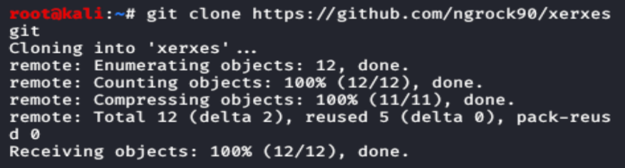

# Denial of Service Attack


A Denial-of-Service (DoS) attack is an attack meant to shut down a machine or network, making it\
inaccessible to its intended users.

#### How It Happens.

The primary focus of a DoS attack is to oversaturate the capacity of a targeted machine, resulting in\
denial-of-service to additional requests.

The tool use perfectly legitimate HTTP traffic. The tool is very useful for security testing.

<figure><figcaption></figcaption></figure>

### Installation

Step 1: Open your kali linux operating system and use the following command to install the tool from\
github.

```bash
sudo git clone https://github.com/ngrok90/xerxes.git
```

<figure><figcaption></figcaption></figure>

Step 2: Now use the following command to move into the directory of the tool.

```bash
cd xerxes
```

<figure><figcaption></figcaption></figure>

Step 3: Now you are in the directory of the tool. Use the following command to start Dos attack.<br>

```bash
./xerxes <domain> 80
```

<figure><figcaption></figcaption></figure>

The tool is running successfully and attacking on the domain.

#### Impact of Dos on Business

The aim of both DOS and DDOS attacks is to make the targeted system unavailable to its intended\
users, disrupting its normal functioning and causing inconvenience, financial losses, or other\
damage.

#### How to Mitigate the Issue

Now that you know what DoS attacks are and why attackers perform them, let's discuss how you can\
protect yourself and your services. Most common mitigation techniques work by

* Detecting illegitimate traffic and blocking it at the routing level
* Managing and analysing the bandwidth of the services, and being mindful when architecting\
  your APIs, so they're able to handle large amounts of traffic.

### Design Structure of DDoS

<figure><figcaption></figcaption></figure>
